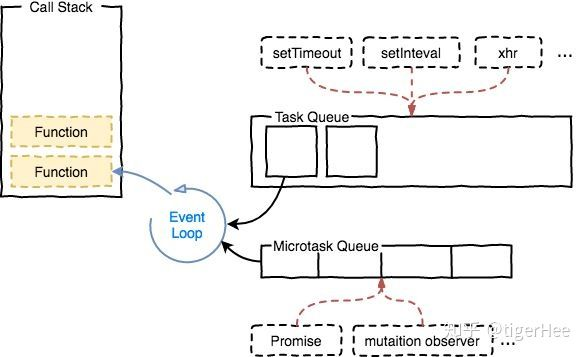

# Event Loop 事件循环

事件循环是js实现异步的一种方法，也是js的执行机制。

`Event Loop`即事件循环，是指浏览器或Node的一种解决`javaScript`单线程运行时不会阻塞的一种机制，也就是我们经常使用异步的原理。

## 同步任务、异步任务

- JS分为同步任务和异步任务
- 同步任务都在主线程上执行，形成一个执行栈
- 主线程之外，事件触发线程管理着一个任务队列，只要异步任务有了运行结果，就在任务队列之中放置一个事件。
- 一旦执行栈中的所有同步任务执行完毕（此时JS引擎空闲），系统就会读取任务队列，将可运行的异步任务添加到可执行栈中，开始执行。



## 宏任务、微任务

在JavaScript中，任务被分为两种，一种宏任务（`MacroTask`）也叫`Task`，一种叫微任务（`MicroTask`）。

**宏任务，MacroTask，也叫tasks**  一些异步任务的回调会依次进入**macro task queue**，等待后续被调用，这些异步任务包括：

- setTimeout
- setInterval
- setImmediate (Node独有)
- requestAnimationFrame (浏览器独有)
- I/O
- UI Rendering (浏览器独有)

**微任务，microtask，也叫jobs**  另一些异步任务的回调会依次进入**micro task queue**，等待后续被调用，这些异步任务包括：

- Promise（事件处理为同步任务，回调为微任务）
- process.nextTick (Node独有)
- Object.observe（废弃）
- MutationObserver


## 关于process.nextTick的一点说明

`process.nextTick`是一个独立于`eventLoop`的任务队列。

在每一个`eventLoop`阶段完成后会去检查这个队列，如果里面有任务，会让这部分任务**优先于微任务执行**。

## 例子知晓一切

```js
console.log('script start');

setTimeout(function() {
  console.log('setTimeout');
}, 0);

Promise.resolve().then(function() {
  console.log('promise1');
}).then(function() {
  console.log('promise2');
});
console.log('script end');
```

首先我们划分几个分类：

### 第一次执行

```js
Tasks：run script、 setTimeout callback

Microtasks：Promise then	

JS stack: script	
Log: script start、script end。
```

执行同步代码，将宏任务（`Tasks`）和微任务(`Microtasks`)划分到各自队列中。

### 第二次执行

```js
Tasks：run script、 setTimeout callback

Microtasks：Promise2 then	

JS stack: Promise2 callback	
Log: script start、script end、promise1、promise2
```

执行宏任务后，检测到微任务(`Microtasks`)队列中不为空，执行`Promise1`，执行完成`Promise1`后，调用`Promise2.then`，放入微任务(`Microtasks`)队列中，再执行`Promise2.then`。

### 第三次执行

```js
Tasks：setTimeout callback

Microtasks：	

JS stack: setTimeout callback
Log: script start、script end、promise1、promise2、setTimeout
```

当微任务(`Microtasks`)队列中为空时，执行宏任务（`Tasks`），执行`setTimeout callback`，打印日志。

### 第四次执行

```js
Tasks：setTimeout callback

Microtasks：	

JS stack: 
Log: script start、script end、promise1、promise2、setTimeout
```

清空`Tasks`队列和`JS stack`。

以上执行帧动画可以查看 [Tasks, microtasks, queues and schedules](https://jakearchibald.com/2015/tasks-microtasks-queues-and-schedules/?_blank)

或许这张图也更好理解些。


## 来练习练习

在执行宏任务的过程中会不断的有微任务加入到微任务队列中，当执行完一个宏任务后先看微任务队列里有没有微任务，如果有先把整队的微任务执行完，然后在执行下一个宏任务，如此以往形成event loop。

也就是说，**执行微任务的前提是同步任务都完成，执行宏任务的前提是微任务队列都清空。**

```js
setTimeout(() => console.log(4))

new Promise(resolve => {
    resolve()
    console.log(1)
}).then(() => {
    console.log(3)
    Promise.resolve().then(() => {
        console.log('before timeout')
    }).then(() => {
        Promise.resolve().then(() => {
            console.log('also before timeout')
        })
    })
})

console.log(2)

// 1, 2, 3, 'before timeout', 'also before timeout', 4
```

```js
console.log('1');

setTimeout(function() {
    console.log('2');
    process.nextTick(function() {
        console.log('3');
    })
    new Promise(function(resolve) {
        console.log('4');
        resolve();
    }).then(function() {
        console.log('5')
    })
})
new Promise(function(resolve) {
    console.log('7');
    resolve();
}).then(function() {
    console.log('8')
})
process.nextTick(function() {
    console.log('6');
})
setTimeout(function() {
    console.log('9');
    process.nextTick(function() {
        console.log('10');
    })
    new Promise(function(resolve) {
        console.log('11');
        resolve();
    }).then(function() {
        console.log('12')
    })
})

// 1，7，6，8，2，4，3，5，9，11，10，12
```

几乎涵盖基本情况的例子:

```js
console.log('1');

new Promise(resolve => {
    console.log('2');
    resolve();
}).then(() => {
    console.log('3');
    setTimeout(() => {
        console.log('4');
    }, 0);
})

console.log('5');

setTimeout(() => {
    console.log('6');
    new Promise(resolve => {
        console.log('7');
        resolve();
    }).then(() => {
        console.log('8');
    })
    console.log('9');
    setTimeout(() => {
        console.log('10');
    }, 0);
}, 0);

new Promise(resolve => {
    console.log('11');
    resolve();
}).then(() => {
    console.log('12');
})

console.log('13');

// 1, 2, 5, 11, 13, 3, 12, 6, 7, 9, 8, 4, 10
```

## 出现 await

**await 语句是同步的，await语句后面全部代码才是异步的微任务，**

一旦遇到await，就立刻让出线程，阻塞后面的代码，对于await来说分两种情况

- 是 promise 对象
- 不是 promise 对象

```js
async function async1() {
    console.log(1) 
    await async2()
    console.log(2)
}
async function async2() {
    console.log(3)
}
console.log(4)
setTimeout(() => {
    console.log(5)
}, 0 )
async1();
new Promise(( resolve ) => {
    console.log(6)
    resolve();
}).then(() => {
    console.log(7) 
})
console.log(8)

// 4, 1. 3, 6, 8, 2, 7, 5
```

区分await后执行promise和非promise的区别

```js
async function t1 () {
    console.log(1)
    new Promise((resolve) => {
        console.log(2)
        resolve();
    } ).then( function () {
        console.log(3)
    })
    await new Promise((resolve) => {
        console.log(4)
        resolve();
    } ).then(() => {
        console.log(5)
    } )
    console.log(6)
    new Promise((resolve) => {
        console.log(7)
        resolve();
    }).then(() => {
        console.log(8)
    })
}

setTimeout(() => {
    console.log(9)
}, 0 )

async function t2() {
    console.log(10)
    await Promise.resolve().then(() => console.log(11))
    console.log(12)
}
t1()
new Promise((resolve) => {
    console.log(13)
    resolve();
}).then(() => {
    console.log(14)
})
t2()

console.log(15);

// 1, 2, 4, 13, 10, 15, 3, 5, 14, 11, 6, 7, 12, 8, 9
```

`await`之后的代码必须等`await`语句执行完成后（包括微任务完成），才能执行后面的，也就是说，**只有运行完`await`语句，才把`await`语句后面的全部代码加入到微任务行列**，所以，在遇到`await`和`promise`时，必须等`await` `promise`函数执行完毕才能对`await`语句后面的全部代码加入到微任务中。


## 参考

- [这一次，彻底弄懂 JavaScript 执行机制](https://juejin.im/post/59e85eebf265da430d571f89#heading-0?_blank)
- [一次弄懂Event Loop（彻底解决此类面试问题）](https://juejin.im/post/5c3d8956e51d4511dc72c200#heading-36?_blank)