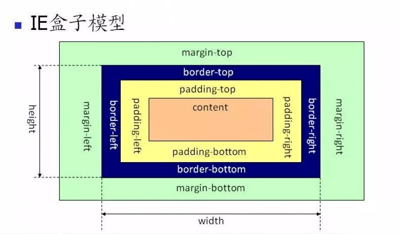

# 盒子模型

盒模型分为标准盒模型和怪异盒模型(IE模型)


box-sizing 的默认值是 content-box，即默认标准模型。

```css
box-sizing: content-box; // 标准模型
box-sizing: border-box;  // IE模型
```

## 区别


标准盒模型：元素的宽度等于style里的width+margin+border+padding宽度

```css
/* 如下代码，整个宽高还是120px */
div{
    box-sizing: content-box;
    margin: 10px;
    width: 100px;
    height: 100px;
    padding: 10px;
}
```



怪异盒模型：元素宽度等于style里的width宽度

```css
/* 如下代码，整个宽高还是100px */
div{
    box-sizing: border-box;
    margin: 10px;
    width: 100px;
    height: 100px;
    padding: 10px;
}
```

注意：如果你在设计页面中，发现内容区被撑爆了，那么就先检查一下border-sizing是什么，最好在引用reset.css的时候，就对border-sizing进行统一设置，方便管理

## JS如何设置盒模型的宽和高

假设已经获取的节点为 dom


```js
//只能获取内联样式设置的宽高
dom.style.width/height

//获取渲染后即时运行的宽高，值是准确的。但只支持 IE
dom.currentStyle.width/height

//获取渲染后即时运行的宽高，值是准确的。兼容性更好
window.getComputedStyle(dom).width/height;

//获取渲染后即时运行的宽高，值是准确的。兼容性也很好，一般用来获取元素的绝对位置，getBoundingClientRect()会得到4个值：left, top, width, height
dom.getBoundingClientRect().width/height;
```