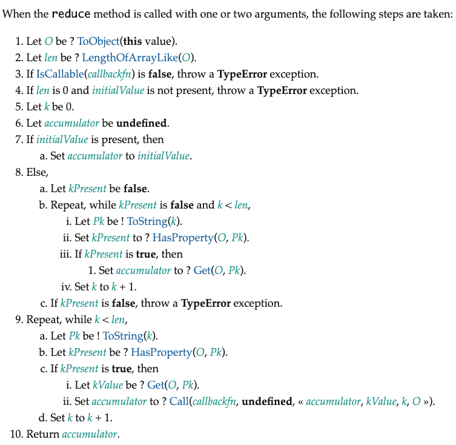

# Array.prototype.reduce()



其中有几个核心要点:

1. 初始值不传
2. 回调函数的参数，返回值处理

```js
Array.prototype.reduce = function (callback, initialValue) {
    // 处理数组类型异常
    if (this === null || this === undefined) {
        throw new TypeError("Cannot read property 'filter' of null or undefined")
    }
    // 处理回调类型异常
    if (Object.prototype.toString.call(callback) !== '[object Function]') {
        throw new TypeError(callback + ' is not a function')
    }

    let O = Object(this),
        len = O.length >>> 0,
        k = 0,
        accumulator = initialValue;

    // 第一个有效值作为累加器的初始值
    if (accumulator === undefined) {
        for (; k < len; K++) {
            if (k in O) {
                accumulator = O[k];
                k++;
                break;
            }
        }
        // 超出数组界限，则TypeError
        if (k > len || len === 0) {
            throw new Error('Each element of the array is empty')
        }
    }

    for (; k < len; k++) {
        if (k in O) {
            // accumulator: 参数传递 实现累加
            accumulator = callback.call(undefined, accumulator, O[k], O)
        }
    }
    return accumulator
} 
```

奉上V8源码，以供大家检查:

```js
function ArrayReduce(callback, current) {
  CHECK_OBJECT_COERCIBLE(this, "Array.prototype.reduce");

  // Pull out the length so that modifications to the length in the
  // loop will not affect the looping and side effects are visible.
  var array = TO_OBJECT(this);
  var length = TO_LENGTH(array.length);
  return InnerArrayReduce(callback, current, array, length,
                          arguments.length);
}

function InnerArrayReduce(callback, current, array, length, argumentsLength) {
  if (!IS_CALLABLE(callback)) {
    throw %make_type_error(kCalledNonCallable, callback);
  }

  var i = 0;
  find_initial: if (argumentsLength < 2) {
    for (; i < length; i++) {
      if (i in array) {
        current = array[i++];
        break find_initial;
      }
    }
    throw %make_type_error(kReduceNoInitial);
  }

  for (; i < length; i++) {
    if (i in array) {
      var element = array[i];
      current = callback(current, element, i, array);
    }
  }
  return current;
}
```

参考：

- [V8源码](https://github.com/v8/v8/blob/ad82a40509c5b5b4680d4299c8f08d6c6d31af3c/src/js/array.js#L1197)
- [ecma262规范](https://tc39.es/ecma262/#sec-array.prototype.reduce)
- [MDN中reduce文档](https://developer.mozilla.org/zh-CN/docs/Web/JavaScript/Reference/Global_Objects/Array/reduce)