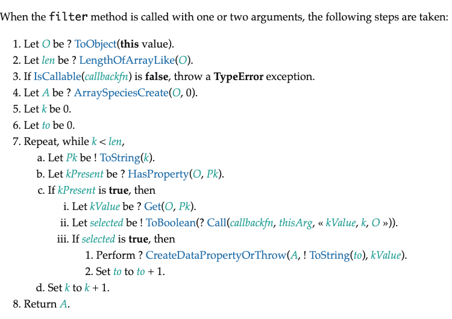

# Array.prototype.filter()



```js
Array.prototype.filter = function (callback, thisArg) {
    // 处理数组类型异常
    if (this === null || this === undefined) {
        throw new TypeError("Cannot read property 'filter' of null or undefined")
    }
    // 处理回调类型异常
    if (Object.prototype.toString.call(callback) !== '[object Function]') {
        throw new TypeError(callback + ' is not a function')
    }

    let O = Object(this),
        len = O.length >>> 0,
        res = [];

    for (let i = 0; i < len; i++) {
        if (i in O) { 
            if (callback.call(thisArg, O[i], i, O)) {
                res.push(O[i]) 
            }
        }
    }

    return res;
} 
```


参考：

- [V8数组部分源码第1025行](https://github.com/v8/v8/blob/ad82a40509c5b5b4680d4299c8f08d6c6d31af3c/src/js/array.js)
- [MDN中filter文档](https://developer.mozilla.org/zh-CN/docs/Web/JavaScript/Reference/Global_Objects/Array/filter)