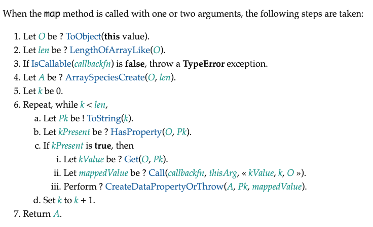

# Array.prototype.map()

依照 [ecma262](https://tc39.es/ecma262/#sec-array.prototype.map)，实现的map的规范如下:



下面根据规范一步步来模拟实现map函数:

```js
Array.prototype.map = function (callback, thisArg) {
    // 处理数组类型异常
    if (this === null || this === undefined) {
        throw new TypeError("Cannot read property 'filter' of null or undefined")
    }
    // 处理回调类型异常
    if (Object.prototype.toString.call(callback) !== '[object Function]') {
        throw new TypeError(callback + ' is not a function')
    }

    let O = Object(this),           // 转换为对象
        len = O.length >>> 0,       // 为Number的正整数
        A = new Array(len);         // 定义原长度的空值数组

    for (let k = 0; k < len; k++) {
        // 使用 in 在原型链查找
        // 如果用 hasOwnProperty 是有问题的，它只能找私有属性
        if (k in O) { 
            let kValue = O[k]
            // 依次传入this, 当前项，当前索引，整个数组
            let mappedValue = callback.call(thisArg, kValue, k, O)
            A[k] = mappedValue
        }
    }
    
    return A;
} 
```

总体实现起来并没那么难，需要注意的就是使用 in 来进行原型链查找。同时，如果没有找到就不处理，能有效处理稀疏数组的情况。

这里解释一下, `length >>> 0`, 字面意思是指"右移 0 位"，但实际上是把前面的空位用0填充，这里的作用是保证len为数字且为整数。

举几个例子：

```js
null >>> 0  //0

undefined >>> 0  //0

void(0) >>> 0  //0

function a (){};  a >>> 0  //0

[] >>> 0  //0

var a = {}; a >>> 0  //0

123123 >>> 0  //123123

45.2 >>> 0  //45

0 >>> 0  //0

-0 >>> 0  //0

-1 >>> 0  //4294967295

-1212 >>> 0  //4294966084
```

最后给大家奉上V8源码，参照源码检查一下，其实还是实现得很完整了。

```js
function ArrayMap(f, receiver) {
  CHECK_OBJECT_COERCIBLE(this, "Array.prototype.map");

  // Pull out the length so that modifications to the length in the
  // loop will not affect the looping and side effects are visible.
  var array = TO_OBJECT(this);
  var length = TO_LENGTH(array.length);
  if (!IS_CALLABLE(f)) throw %make_type_error(kCalledNonCallable, f);
  var result = ArraySpeciesCreate(array, length);
  for (var i = 0; i < length; i++) {
    if (i in array) {
      var element = array[i];
      %CreateDataProperty(result, i, %_Call(f, receiver, element, i, array));
    }
  }
  return result;
}
```

参考：

- [V8源码](https://github.com/v8/v8/blob/ad82a40509c5b5b4680d4299c8f08d6c6d31af3c/src/js/array.js#L1132)
- [ecma262规范](https://tc39.es/ecma262/#sec-array.prototype.map)
- [MDN中map文档](https://developer.mozilla.org/zh-CN/docs/Web/JavaScript/Reference/Global_Objects/Array/map)