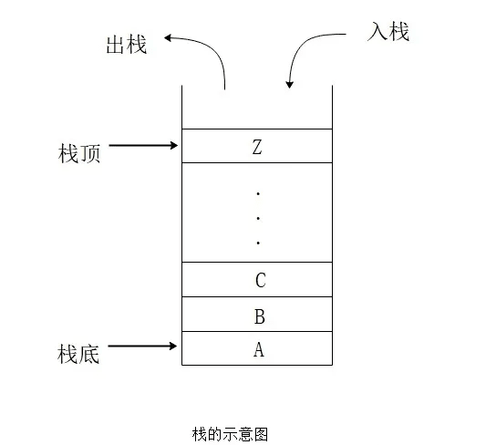

# 栈(Stack)



**堆栈遵循LIFO（`后进先出`）的原则**

如果你把书堆叠起来，上面的书会比下面的书先拿。或者当你在网上浏览时，后退按钮会引导你到最近浏览的页面。

Stack具有以下常见方法：

方法  | 描述
------------- | -------------
push  | 入栈
pop  | 出栈
peek    | 查看顶部元素
length     | 返回堆栈中元素的数量
clear  | 清空栈

Javascript中的数组具有Stack的属性，但是我们使用 `function Stack()`从头开始构建Stack

```js
function Stack() {
    this.count = 0;
    this.storage  = [];

    // 入栈
    this.push = (val) => {
        this.storage[this.count] = val;
        this.count++;
    }

    // 出栈 => 删除栈顶元素，并返回
    this.pop = () => {
        if (this.count === 0) {
            return undefined;
        }
        this.count--;
        return this.storage[this.count];
    }

    // 查看 => 查看栈顶元素
    this.peek = () => {
        return this.storage[this.count - 1]
    }

    // 栈长度
    this.length = () => {
        return this.count;
    }

    // 清空栈
    this.clear = () => {
        this.storage = [];
        this.count = 0;
    }
}
```

```js
// test
const stack = new Stack();

console.log(stack.peek())       // undefined

stack.push('Apple')
stack.push('Banana')
stack.push('Pear')

console.log(stack.length())     // 3

console.log(stack.peek())       // Pear
console.log(stack.pop())        // Pear  

console.log(stack.length())     // 2
console.log(stack.pop())        // Banana  
console.log(stack.pop())        // Apple  
console.log(stack.pop())        // undefined  
console.log(stack.length())     // 0
console.log(stack.peek())       // undefined
```

至此，我们已经可以用JS实现一个栈，但是你仍可能处于不知道如何正确使用的状态，接下来，我们举两个例子，一起看看栈的使用。

## 判断一个字符串是不是回文

回文是指一个字符串，从前往后写和从后往前写结果都是一样的，比如单词 `level` ， `racecar`，就是回文，数字 `1001` 也是回文。

我们采用栈，可以很轻松判断一个字符串是否是回文，实现算法很简单，相信你们都猜到了。

我们把字符串从左到右依次压入栈，这样，栈中保存了该字符串反转后的字符，我们再依次出栈，通过比较出栈后的字符串是否与原字符串是否相等，就可判断该字符串是否是回文。

具体代码实现如下：

```js
function isPalindrome(word) {
    const stack = new Stack();

    for (let i = 0; i < word.length; i++) {
        stack.push(word[i])
    }
    
    let words = '';
    while(stack.length() > 0) {
        words += stack.pop();
    }

    return word == words;
}

console.log(isPalindrome('level'))  // true 
console.log(isPalindrome('1001'))   // true
console.log(isPalindrome('word'))   // false
```