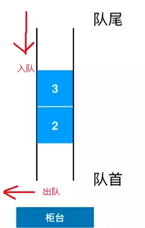

# 队列(Queue)



Queue与Stack类似。唯一不同的是，**Queue使用的是FIFO原则（`先进先出`）**。

换句话说，当你排队等候公交车时，队列中的第一个总是先上车。


方法  | 描述
------------- | -------------
enqueue  | 入队
dequeue  | 出队
front    | 查看队首元素
back     | 查看队尾元素
toString  | 显示队列所有元素
empty    | 判断队列是否为空
size     | 对列长度
clear    | 清空队列

```js
function Queue() {
    this.collection = [];
    this.enqueue = (val) => {
        this.collection.push(val)
    }
    this.dequeue = () => {
        return this.collection.shift()
    }
    this.front = () => {
        return this.collection[0]
    }
    this.back = () => {
        return this.collection[this.collection.length - 1]
    }
    this.toString = () => {
        return this.collection.join('-')
    }
    this.empty = () => {
        return this.collection.length === 0;
    }
    this.size = () => {
        return this.collection.length;
    }
    this.clear = () => {
        this.collection = []
    }
}
```

```js
const queue = new Queue();

queue.enqueue('Libai')
queue.enqueue('看外面')
queue.enqueue('有飞机')
queue.enqueue('哈哈哈')

console.log(queue.toString())   // Libai-看外面-有飞机-哈哈哈

console.log(queue.back())       // 哈哈哈
console.log(queue.front())      // Libai

console.log(queue.dequeue())    // Libai

console.log(queue.front())      // 看外面

console.log(queue.empty())      // false

queue.clear()

console.log(queue.empty())      // true

console.log(queue.front())      // undefined
console.log(queue.dequeue())    // undefined
```

## 优先队列

在一般情况下，从队列中删除的元素，一定是率先入队的元素。但是也有一些使用队列的应用，在删除元素时**不必遵守先进先出**的约定。

这种应用，需要使用一个叫做优先队列的数据结构来进行模拟。

优先队列在生活中的例子: 比如普通用户上医院需要排队挂号, 但是具有 VIP 的用户能'插队'办理业务。

**`没错，有钱就是了不起(*^▽^*)`**

用代码实现如下:

```js
// 重新定义enqueue方法
this.enqueue = (item, level) => {
    const data = {item, level};
    if (this.empty()) {
        this.collection.push(data)
    } else {
        let add = false;
        for (let i = 0; i < this.size(); i++) {
            if (level < this.collection[i][1]) {
                this.collection.splice(i, 0, data)
                add = true;
                break;
            }
        }
        add && this.collection.push(data)
    }
}
```

测试一下

```js
const queue = new Queue();

queue.enqueue(['gannicus', 3])
queue.enqueue(['spartacus', 1])
queue.enqueue(['crixus', 2])
queue.enqueue(['oenomaus', 4])

console.log(queue.collection)

// [
//   ['spartacus', 1]
//   ['crixus', 2]
//   ['gannicus', 3]
//   ['oenomaus', 4]
// ]
```

可以看到都是按指定等级来排序的，没错，**`有钱就是了不起`**


## 循环队列

循环队列的一个例子就是击鼓传花游戏

在这个游戏中，孩子们围成一个圆圈，把花尽快地传递给旁边的人。

某一时刻传花停止，这个时候花在谁手里，谁就退出圆圈、结束游戏。重复这个过程，直到只剩一个孩子（胜者）。

```js
const drumGame = function(names, number) {
    const queue = new Queue()
    for (let i = 0; i < names.length; i++) {
        queue.enqueue(names[i])
    }

    while (queue.size() > 1) {
        for (let i = 0; i < number; i++) {
            // 这句是循环队列的核心
            // 给定一个数字，然后迭代队列。从队列开头移除一项，再将其添加到队列末尾
            // 模拟击鼓传花（如果你把花传给了旁边的人，你被淘汰的威胁就立刻解除了）
            queue.enqueue(queue.dequeue())  
        }
        const loser = queue.dequeue()
        console.log(loser + ' 出局')
    }
    return queue.dequeue()           // 留下的最后一个就是胜利者
}

const names = ['John', 'Jack', 'Camila', 'Ingrid', 'Carl']
const winner = drumGame(names, 7) // 假设每轮传花 7 次
console.log('胜利者是: ' + winner)

// Camila 出局
// Jack 出局
// Carl 出局
// Ingrid 出局
// 胜利者是: John
```

## 实现基数排序

基数排序（radix sort）属于“分配式排序”（distribution sort），它是透过键值的部份资讯，将要排序的元素分配至某些“桶”中，藉以达到排序的作用，基数排序法是属于稳定性的排序，其时间复杂度为O (nlog(r)m)，其中r为所采取的基数，而m为堆数，在某些时候，基数排序法的效率高于其它的稳定性排序法。

先看一下基数排序的的实现步骤（以两位数为例），需要扫描两次，第一次按个位数字进行排序，第二次按十位数字排序，每个数字根据对应的数值分配到到不同的盒子里，最后将盒子的数字依次取出，组成新的列表即为排序好的数字。

假设我们有一串数字

```
73, 22, 93, 43, 55, 14, 28, 65, 39, 81
```

经过基数排序第一次扫描之后，数字被分配到如下盒子中：

```js
Bin 0: 
Bin 1: 81
Bin 2: 22
Bin 3: 73, 93, 43
Bin 4: 14
Bin 5: 55, 65
Bin 6:
Bin 7: 
Bin 8: 28
Bin 9: 39
```

根据盒子的顺序，对数字进行第一次排序的结果如下

```
81, 22, 73, 93, 43, 14, 55, 65, 28, 39
```

然后根据十位数字排序，再放到不同的盒子里

```js
Bin 0: 
Bin 1: 14
Bin 2: 22, 28
Bin 3: 39
Bin 4: 43
Bin 5: 55
Bin 6: 65
Bin 7: 73
Bin 8: 81
Bin 9: 93
```

接下来将这些盒子中的数值重新串接起来，整个数列已经排序完毕

```
14, 22, 28, 39, 43, 55, 65, 73, 81, 93
```

唉，开始写代码~~

拿起键盘就是一顿噼里啪啦~~ 噼里啪啦~~ 梭哈~~

```js
/**
 * COPY 未验证 暂定
 */
//基数排序

var queues = [];    //定义队列数组
var nums = [];      //定义数字数组

//选十个0~99的随机数进行排序
for ( var i = 0 ; i < 10 ; i ++ ){
    queues[i] = new Queue();
    nums[i] = Math.floor( Math.random() * 101 );
}

//排序之前
console.log( 'before radix sort: ' + nums );

//基数排序
distribution( nums , queues , 10 , 1 );
collect( queues , nums );
distribution( nums , queues , 10 , 10 );
collect( queues , nums );

//排序之后
console.info('after radix sort: ' + nums );

//根据相应的（个位和十位）数值，将数字分配到相应队列

function distribution ( nums , queues , n , digit ) {  //digit表示个位或者十位的值
    for( var i = 0 ; i < n ; i++ ){
        if( digit == 1){
            queues[ nums[i] % 10 ].enqueue( nums[i] );
        }else{
            queues[ Math.floor( nums[i] / 10 ) ].enqueue( nums[i] );
        }
    }
}

//从队列中收集数字

function collect ( queues , nums ) {
    var i = 0;
    for ( var digit = 0 ; digit < 10 ; digit ++ ){
        while ( !queues[digit].empty() ){
            nums[ i++ ] = queues[digit].front();
            queues[digit].dequeue();
        }
    }
}
```