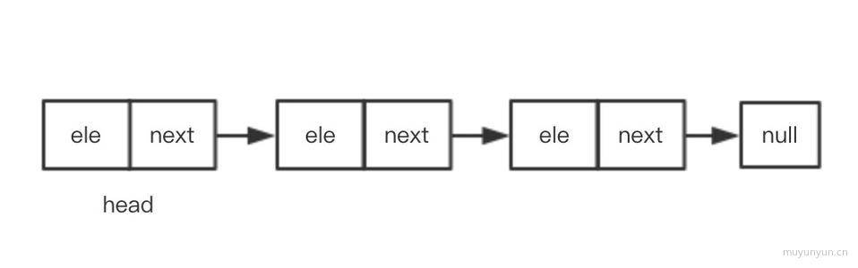
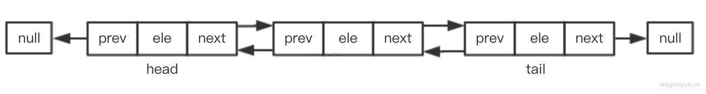

# 链表(Linked-list)

如果你发现数组在实际使用时很慢，就可以考虑使用链表来替代它。除了对数据的随机访问，链表几乎可以用在任何可以使用一维数组的情况中。如果需要随机访问，数组仍然是更好的选择。

## 链表的定义

另一个例子是寻宝游戏。你有一条线索，这条线索就是指向寻找下一条线索的地点的指针。你顺着这条链接去下一个地点，得到另一条指向再下一处的线索。得到链表中间的线索的唯一办法，就是从起点（第一条线索）顺着链表寻找。

还有一个可能是用来说明链表的最流行的例子，那就是火车。一列火车是由一系列车厢（也称车皮）组成的。每节车厢或车皮都相互连接。你很容易分离一节车皮，改变它的位置、添加或移除它。下图演示了一列火车。每节车皮都是链表的元素，车皮间的连接就是指针。



## Node类

Node类包含连个属性： element 用来保存节点上的数据，next 用来保存指向下一个节点的链接，具体实现如下：

```js
function Node(element) {
    this.element = element;     // 当前节点的元素
    this.next = null;           // 下一个节点链接
}
```

## LinkedList类

LinkedList类提供了对链表进行操作的方法，包括插入删除节点，查找给定的值等。值得注意的是，它只有一个
属性，那就是使用一个 Node 对象来保存该链表的头节点。

```js
function linkedList() {

    let head = null,                // 第一个链表 默认标识
        length = 0,                 // 链表长度
        current;                    // 当前传入元素

    // 添加
    this.push = (el) => {
        const node = new Node(el)
        if (head === null) {   // 插入第一个链表
            head = node;
        } else {
            current = head;
            while (current.next) {  // 获取最后一个链表
                current = current.next
            }
            current.next = node     // 将最后一个链表的next赋值为新元素
        }
        length++    // 链表长度
    }

    // 移除
    this.removeAt = (index) => {
        if (index >= 0 && index < length) {     // 是否越界
            // 移除第一个链表，特殊对待
            if (index === 0) {
                head = head.next
            } else {
                let previous;
                current = head;
                for (let i = 0; i < index; i++) {
                    previous = current
                    current = current.next
                }
                // 移除当前索引的 current
                previous.next = current.next
            }
            length--
            return head
        }
        return undefined;
    }

    // 指定位置添加
    this.insert = (el, index) => {
        if (index >= 0 && index < length) {     // 是否越界
            const node = new Node(el);
            if (index === 0) {
                current = head
                node.next = current
                head = node
            } else {
                let previous;
                current = head;
                for (let i = 0; i < index; i++) {
                    previous = current
                    current = current.next
                }
                // 介于 previous & current 两者间插入
                previous.next = node
                node.next = current
            }
            length++
            return head
        }
        return false;
    }

    // 查找是否存在，有 => 索引，否 => -1
    this.indexOf = (el) => {
        current = head
        for (let i = 0; i < length; i++) {
            if (current.element === el) {
                return i
            }
            current = current.next
        }
        return -1
    }

    // 移除
    this.remove = (index) => {
        this.removeAt(this.indexOf(element))
    }

    // 是否为空
    this.isEmpty = () => {
        return length === 0
    }

    // 获取长度
    this.size = () => {
        return length
    }

    // 获取最开头的链表
    this.getHead = () => {
        return head
    }

    // 打印链表
    this.toString = () => {
        if (head === null) {
            return ''
        }
        current = head
        let str = current.element
        while (current.next) {
            current = current.next
            str += current.element
        }
        return str
    }
}
```

## 双向链表

双向链表和普通链表的区别在于，在链表中，一个节点只有链向下一个节点的链接；

而在双向链表中，链接是双向的：一个链向下一个元素，另一个链向上一个元素




```js
function DoublyLinkedList() {
    let head = null,                // 第一个链表
        tail = null,                // 最后一个链表
        length = 0,                 // 链表长度
        current, previous;          // 当前传入元素
        
    // 指定位置添加
    this.insert = (el, index) => {
        if (index >= 0 && index < length + 1) {     // 是否越界
            const node = new DoublyNode(el);
            if (index === 0) {
                if (head == null) {         // ① 链表内元素为空
                    head = node
                    tail = node
                } else {                    // 链表内存在元素
                    current = head
                    current.prev = node
                    node.next = current
                    head = node
                }
            } else if (index === length) {  // ② 在末尾插入元素
                current = tail
                current.next = node
                node.prev = current
                tail = node
            } else {                        // ③ 在链表中插入元素
                current = head
                for (let i = 0; i < index; i++) {
                    previous = current
                    current = current.next
                }
                previous.next = node
                node.next = current
                current.prev = node
                node.prev = previous
            }
            length++
                console.log(head, tail)
            return true
        }
        return false;
    }

    // 指定位置移除
    this.removeAt = (index) => {
        if (index >= 0 && index < length) {     // 是否越界
            if (index === 0) {
                if (length === 1) {
                    head = null
                    tail = null
                } else {
                    current = head
                    head = current.next
                    head.prev = current.prev
                }
            } else if (index === length - 1) {
                current = tail
                tail = current.prev
                tail.next = current.next
            } else {
                current = head
                for (let i = 0; i < index; i++) {
                    previous = current
                    current = current.next
                }
                previous.next = current.next
                current.next.prev = previous
            }
            return true
        }
        return undefined
    }

    this.log = function() {
        current = head
        let str = current.element
        while (current.next) {
            current = current.next
            str = str + ' ' + current.element
        }
        return str
    }
}
```

## 循环链表

循环链表可以像链表一样只有单向引用，也可以像双向链表一样有双向引用。循环链表和链表之间唯一的区别在于，最后一个元素指向下一个元素的指针（tail.next）不是引用undefined，而是指向第一个元素（head）


