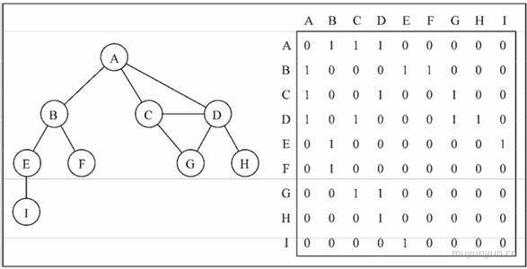
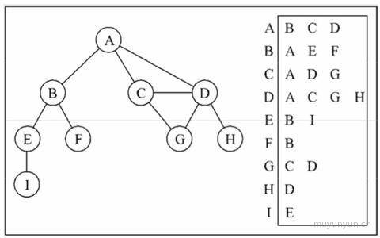
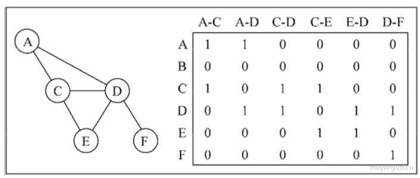
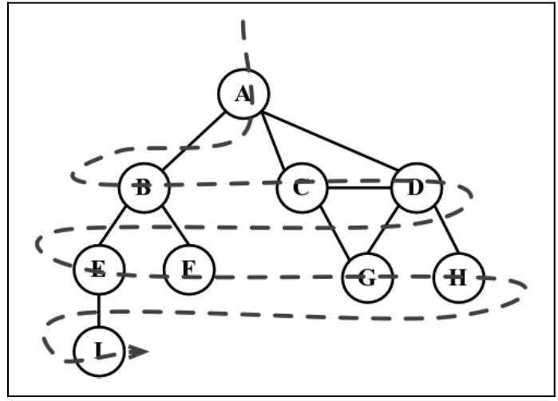

# 图(Graph)

图是一种`非线性数据结构`。它的表示有以下几种:


## 邻接矩阵

邻接矩阵是表示图的常用方法, 用二维数组来表示, 数组的每个下标对应每个点。

当两个点有连线则二维数组的值为 1, 否则二维数组的值为 0。但是这种表示方法会照成存储空间的浪费(因存在大量 0)。

如果索引为i的节点和索引为j的节点相邻，则`array[i][j] === 1`，否则`array[i][j] === 0`





## 邻接表

左侧为存储的顶点, 右侧为与之想对应的点, 后文会采用这种方式实现图。



## 关联矩阵

行表示点, 列表示边。关联矩阵通常用于边的数量比顶点多的情况，以节省空间和内存。



## 实现

```js
class Graph {
    constructor() {
        this.vertices = []          // 存储顶点
        this.adjList = new Map()    // 存储边
    }

    // 添加顶点
    addVertex(v) {
        if (!this.vertices.includes(v)) {
            this.vertices.push(v)
            this.adjList.set(v, [])
        }
    }

    // 往指定的点添加相邻的点
    addEdge(v, w) {
        // 验证顶点是否存在于图中
        if (!this.adjList.get(v)) {
            this.addVertex(v)
        }
        if (!this.adjList.get(w)) {
            this.addVertex(w)
        }
        this.adjList.get(v).push(w)
        this.adjList.get(w).push(v)
    }

    log() {
        let str = ''
        let neighbors
        for (let i = 0; i < this.vertices.length; i++) {
            str += `${this.vertices[i]} -> `
            neighbors = this.adjList.get(this.vertices[i]).join(' ')
            str += neighbors + '\n'
        }
        return str
    }
}
```

按之前邻接表的图示, 跑如下测试用例:

```js
const graph = new Graph()

var topArr = ['A', 'B', 'C', 'D', 'E', 'F', 'G', 'H', 'I']
for (let i of topArr) {
    graph.addVertex(i)
}

graph.addEdge('A', 'B')
graph.addEdge('A', 'C')
graph.addEdge('A', 'D')
graph.addEdge('B', 'E')
graph.addEdge('B', 'F')
graph.addEdge('C', 'D')
graph.addEdge('C', 'G')
graph.addEdge('D', 'G')
graph.addEdge('D', 'H')
graph.addEdge('E', 'I')

console.log(graph.log())
// A -> B C D
// B -> A E F
// C -> A D G
// D -> A C G H
// E -> B I
// F -> B
// G -> C D
// H -> D
// I -> E
```


## 广度优先遍历

顾名思义, 广度优先即横向优先, 英文名为 breadth first search(BFS), 它示意图如下:



思想: 用到了`队列`的思想 (标白: 未发现; 标灰: 已找寻)

- 创建队列 u, 将标灰的顶点插入队列;
- 若队列 u 不为空;
    - 从队列取出值 v;
    - 将 v 的相邻节点标灰并插入队列 u;

```js
bfs(v, callback) {
    const obj = {}
    const queue = new Queue()

    for (let i of this.vertices) { // 初始化颜色
        obj[i] = 'white'
    }

    obj[v] = 'red'                  // 已完成
    queue.enqueue(v)                // 搜索值先入栈

    let shiftQueue, neighbour

    while (!queue.empty()) {
        shiftQueue = queue.dequeue()    
        neighbour = this.adjList.get(shiftQueue)

        for (let i of neighbour) {      // 循环相邻节点
            if (obj[i] === 'white') {   // 未完成的
                obj[i] = 'red'
                queue.enqueue(i)
            }
        }

        if (callback) {
            callback(shiftQueue)
        }
    }
}
```

```js
graph.bfs('A', (e) => console.log(e))
graph.bfs('B', (e) => console.log(e))
// A B C D E F G H I
// B A E F C D I G H
```

## 广度优先遍历求最短路径

在上述 bfs 函数实现的基础上, 加入两个变量分别存储距离以及最短路径上先前的点

```js
BFS(v) {
    const obj = {}
    const queue = new Queue()

    const distance = {} // 距离
    const prev = {}     // 前溯点

    for (let i of this.vertices) { // 初始化颜色
        obj[i] = 'white'
        distance[i] = 0
        prev[i] = null
    }

    obj[v] = 'red'                  // 搜索值
    queue.enqueue(v)                // 入栈

    let shiftQueue, neighbour

    while (!queue.empty()) {
        shiftQueue = queue.dequeue()
        neighbour = this.adjList.get(shiftQueue)

        for (let i of neighbour) {
            if (obj[i] === 'white') {
                obj[i] = 'red'
                queue.enqueue(i)

                // 第二行的点距离第一行的点相差为 1, 第三行的点距离第二行的点相差为 1, 以此类推。
                // shiftQueue 是 i 的前溯点 (上一级的节点)
                distance[i] = distance[shiftQueue] + 1 
                prev[i] = shiftQueue   
            }
        }
    }

    return {
        distance,
        prev
    }
}

logMinPath(v) {
    const { distance, prev } = this.BFS(v)
    let path = ''
    const arr = []
    Object.keys(distance).map(r => {
        path = r
        while (prev[r]) { // 终止条件为 prev 中值为 null 时
            path = prev[r] + ' - ' + path
            r = prev[r]
        }
        arr.push(path)
    })
    return arr.join('\n')
}

console.log(graph.BFS('A'))

// A
// A - B
// A - C
// A - D
// A - B - E
// A - B - F
// A - C - G
// A - D - H
// A - B - E - I
```


## 深度优先遍历

