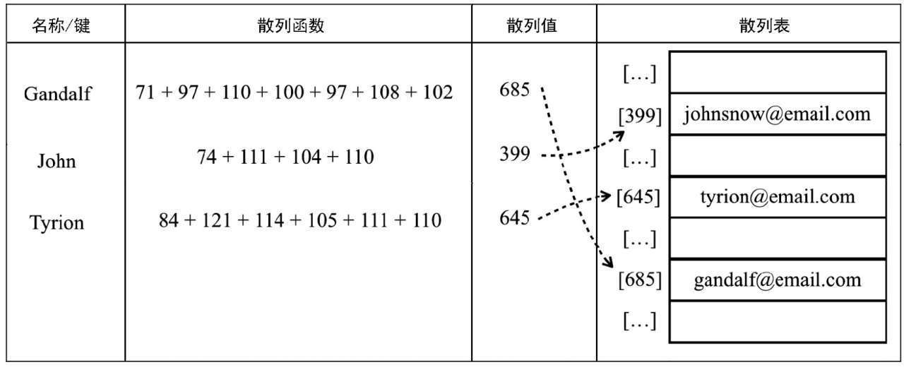
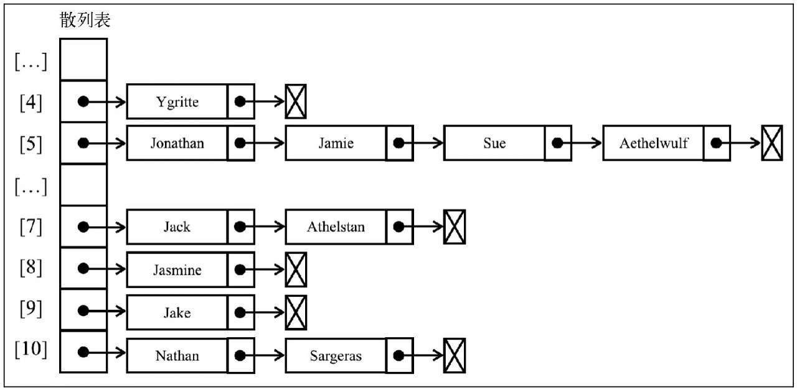
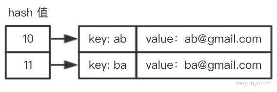

# 散列表(HashMap)

散列表（Hash table，也叫哈希表）, 根据键（Key）直接访问在内存存储位置的数据结构。

散列是一种常用的数据存储技术，散列后的数据可以快速地插入或取用，但是查找数据却效率低下



上图中通过哈希函数将键值转换成哈希值, 然后再将哈希值指向具体的值。接着我们来构造 HashTable 类, 代码如下:

方法  | 描述
------------- | -------------
put  | 向散列表增加一个新的项（也能更新散列表)
remove  | 根据键值移除项
get    | 返回根据键值检索到的特定的值

## 实现

```js
class ValuePair {
    constructor(key, value) {
        this.key = key
        this.value = value
    }
    toString() {
        return `[${this.key}: ${this.key}]`
    }
}
class HashTable {
    constructor() {
        this.toStrFn = (item) => {
            if (item === null) {
                return 'NULL'
            } else if (item === undefined) {
                return 'UNDEFINED'
            } else if (typeof item === 'string' || item instanceof String) {
                return `${item}`                
            } else {
                item.toString()
            }
        }
        this.table = {}
    }
    
    put(key, value) {
        if (key != null && value != null) {
            const position = this.hashCode(key)
            console.log(position)
            this.table[position] = new ValuePair(key, value)
            return true
        }
        return false
    }

    get(key) {
        const valuePair = this.table[this.hashCode(key)]
        return valuePair == null ? undefined : valuePair.value
    }

    remove(key) {
        const hash = this.hashCode(key)
        const valuePair = this.table[hash]
        if (valuePair != null) {
            delete this.table[hash]
            return true
        }
        return false
    }

    // 哈希算法
    hashCode(key) {
        if (typeof key === 'number') {
            return key
        }
        const tableKey = this.toStrFn(key)
        let hash = 0
        for (let i = 0; i < tableKey.length; i++) {
            hash += tableKey.charCodeAt(i)
        }
        return hash % 37
    }
}
```

```js
const hash = new HashTable()
hash.put('Libai', 'aaa@qq.com')
hash.put('xiaobai', 'bbb@qq.com')
hash.put('ab', 'cc@qq.com')
hash.put('ba', 'dd@qq.com') // ab 和 ba 的哈希值相同, 后者会把前者覆盖

console.log(hash.table)
```

这里的 ab 和 ba 的哈希值相同, 后者会把前者覆盖, 所以我们需要解决一下这个问题:

## 链表法

分离链接法包括为散列表的每一个位置创建一个链表并将元素存储在里面。

它是解决冲突的最简单的方法，但是在HashTable实例之外还需要额外的存储空间。

例如，我们在之前的测试代码中使用分离链接并用图表示的话，输出结果将会是如下这样（为了简化，图表中的值被省略了）。



改写以下代码:

```js
put(key, value) {
    if (key != null && value != null) {
        const position = this.hashCode(key)
        // 默认添加链表
        if (this.table[position] == null) {
            this.table[position] = new linkedList()
        } 
        this.table[position].push(new ValuePair(key, value))
        return true
    }
    return false
}

get(key) {
    const position = this.hashCode(key)
    const linkedList = this.table[position]

    // 值不为空
    if (linkedList != null && !linkedList.isEmpty()) {
        let current = linkedList.getHead()
        // 从链表第一个链表开始遍历
        // key相等则返回, 否则继续下一个链表
        while (current != null) {
            if (current.element.key === key) {
                return current.element.value
            }
            current = current.next
        }
    }
    return undefined
}

remove(key) {
    const position = this.hashCode(key)
    const linkedList = this.table[position]

    // 同理get方法
    if (linkedList != null && !linkedList.isEmpty()) {
        let current = linkedList.getHead()
        while (current != null) {
            if (current.element.key === key) {
                linkedList.remove(current.element)
                if (linkedList.isEmpty()) {     // 删除链表
                    delete this.table[position]
                }
                return true
            }
            current = current.next
        }
    }
    return false
}
```

接着来测试下完成的哈希表, 测试用例如下:

```js
const hash = new HashTable()

hash.put('Libai', 'aaa@qq.com')
hash.put('xiaobai', 'bbb@qq.com')
hash.put('ab', 'cc@qq.com')
hash.put('ba', 'dd@qq.com') 

console.log(hash.get('ab'))         // cc@qq.com
console.log(hash.get('ba'))         // dd@qq.com
console.log(hash.remove('ab'))      // true
console.log(hash.remove('ba'))      // true
console.log(hash.get('ab'))         // undefined
console.log(hash.get('ba'))         // undefined

console.log(hash.table)             // ab和ba共有的链表同样删除
```

## 线性探查法

另一种解决冲突的方法是`线性探查`。之所以称作线性，是因为它处理冲突的方法是将元素直接存储到表中，而不是在单独的数据结构中。

如果当前所要存储的 hash 值已存在于存储空间, 则判断存储空间里是否已存储 hash + 1, 若无则存储 hash + 1, 若有则判断存储空间里是否已存储 hash + 2, 依次类推。参考图如下:



```js
put(key, value) {
    if (key != null && value != null) {
        const position = this.hashCode(key)
        // 为空则直接添加
        // 否则每次循环定位+1, 直到为null即可添加
        if (this.table[position] == null) {
            this.table[position] = new ValuePair(key, value)
        } else {
            let index = position + 1;
            while (this.table[index] != null) {
                index++
            }
            this.table[index] = new ValuePair(key, value)
        }
        return true
    }
    return false
}

get(key) {
    const position = this.hashCode(key)
    if (this.table[position] != null) {
        if (this.table[position].key === key) {
            return this.table[position].value
        }
        let index = position + 1
        while (this.table[index] != null && this.table[index].key != key) {
            index++
        }
        return this.table[index].value
    }
    return undefined
}

remove(key) {
    const position = this.hashCode(key)
    if (this.table[position] != null) {
        if (this.table[position].key === key) {
            delete this.table[position]
            this.verify(key, position)
            return true
        }
        let index = position + 1
        while (this.table[index] != null && this.table[index].key != key) {
            index++
        }
        delete this.table[index]
        this.verify(key, position)
        return true
    }
    return false
}

/**
 * key => 被删除的key
 * position => 该key被删除的位置
 * 来自: 学习JavaScript数据结构与算法(第3版) 真是太严谨了, 追求极致的代码
 */
verify(key, position) {
    let hash = this.hashCode(key)
    let index = position + 1
    while (this.table[index] != null) {
        // 计算当前元素的hash值
        let posHash = this.hashCode(this.table[index].key)
        // 表示需要将元素移动到被删除的position位置上(也就是上一个位置)
        if (posHash <= hash || posHash <= position) {
            this.table[position] = this.table[index]
            delete this.table[index]
            position = index    // 继续重复后面的元素
        }
        index++
    }
}
```

## 更好的哈希算法

```js
// 哈希算法
function keyToHash(key) {
    let hash = 5381    // 取一个素数
    for (let i = 0; i < key.length; i++) {
        hash = hash * 33 + key.charCodeAt(i)
    }
    hash = hash % 1013 // 除以另外一个素数
    return hash
}
```