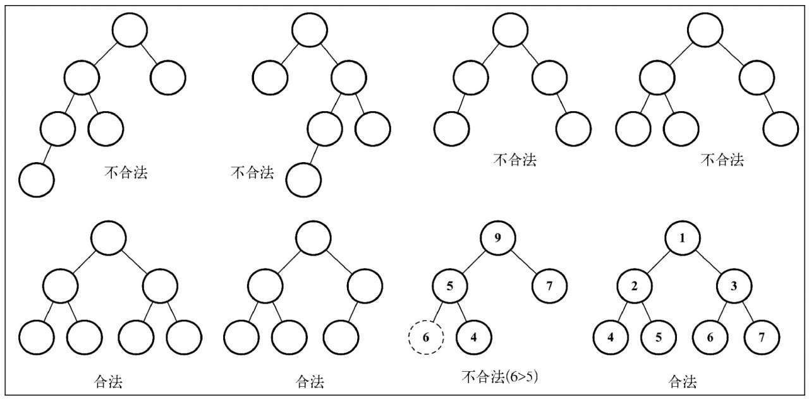
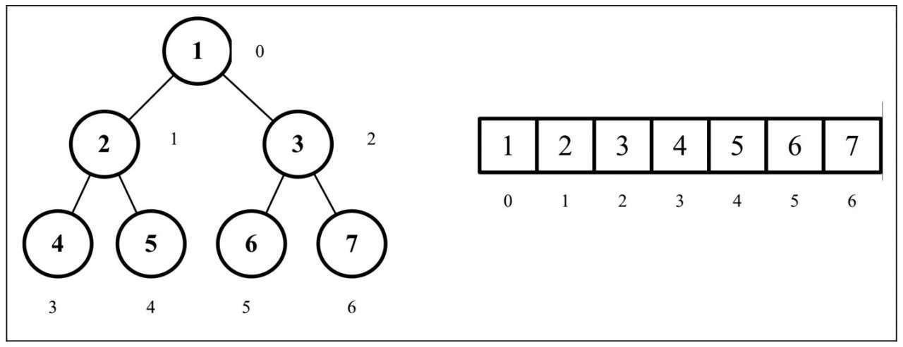
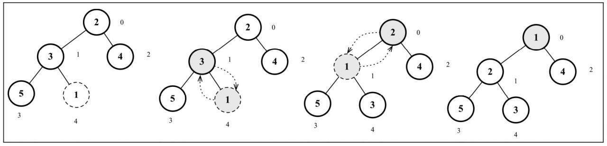
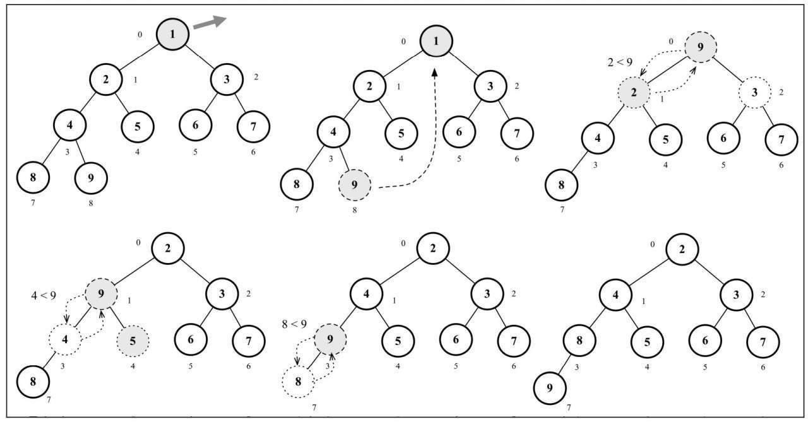

# 堆

我们将要学习一种特殊的二叉树，也就是堆数据结构，也叫作二叉堆。

二叉堆是计算机科学中一种非常著名的数据结构，由于它能高效、快速地找出最大值和最小值，常被应用于优先队列。

## 定义

- 它是一棵完全二叉树，表示树的每一层都有左侧和右侧子节点（除了最后一层的叶节点），并且最后一层的叶节点尽可能都是左侧子节点，这叫作结构特性。
- 二叉堆不是最小堆就是最大堆。最小堆允许你快速导出树的最小值，最大堆允许你快速导出树的最大值。所有的节点都大于等于（最大堆）或小于等于（最小堆）每个它的子节点。这叫作**堆特性**。

下图展示了一些合法的和不合法的堆。




- 每个子节点都要大于等于父节点(小于等于父节点)
- 当父节点大于或等于(小于或等于)它的每一个子节点时，称为**最大堆（最小堆）**

```js
class Heap {
    constructor() {
        // 父节点 和 传进的值 对比
        this.compareFn = (a, b) => {
            return a >= b
        }
        // 交换节点位置
        this.swap = (array, a, b) => {
            [array[a], array[b]] = [array[b], array[a]]
        }
        this.heap = []
    }

    // 获取左侧子节点
    getLeftIndex(index) {
        return 2 * index + 1
    }

    // 获取右侧子节点
    getRightIndex(index) {
        return 2 * index + 2
    }

    // 获取父节点
    getParentIndex(index) {
        if (index === 0) {
            return undefined
        }
        return Math.floor((index - 1) / 2)
    }

    // 最小值
    findMinimum() {
        return this.isEmpty() ? undefined : this.heap[0]
    }

    size() {
        return this.heap.length
    }

    isEmpty() {
        return this.size() === 0
    }
}
```



## 最小堆

向堆中插入值是指将值插入堆的底部叶节点（数组的最后一个位置）, 然后再执行`siftUp`方法，表示我们将要将这个值和它的父节点进行交换，直到父节点小于这个插入的值




```js
// 向堆中插入值
insert(value) {
    if (value != null) {
        this.heap.push(value)
        this.siftUp(this.heap.length - 1)   // 当前索引
        return true
    }
    return false
}

// 上浮
siftUp(index) {        
    // 将要将这个值和它的父节点进行交换，直到父节点小于这个插入的值
    let parent = this.getParentIndex(index)
    while ( index > 0 && this.compareFn(this.heap[parent], this.heap[index])) {
        this.swap(this.heap, parent, index)
        index = parent
        parent = this.getParentIndex(index)
    }
}
```

```js
const heap = new Heap()

heap.insert(2)
heap.insert(3)
heap.insert(4)
heap.insert(5)

heap.insert(1)

console.log(heap.heap) // [1, 2, 4, 5, 3]
```

导出堆中的最小值或最大值

移除最小值（最小堆）或最大值（最大堆）表示移除数组中的第一个元素（堆的根节点）。在移除后，我们将堆的最后一个元素移动至根部并执行siftDown函数，表示我们将交换元素直到堆的结构正常。

```js
siftDown(index) {
    const left = this.getLeftIndex(index)
    const right = this.getRightIndex(index)
    if (
        this.compareFn(this.heap[index], this.heap[left]) &&
        this.compareFn(this.heap[index], this.heap[right])
    ) {
        if (!this.compareFn(this.heap[right], this.heap[left])) {
            this.swap(this.heap, right, index)
            this.siftDown(right)
        } else {
            this.swap(this.heap, left, index)
            this.siftDown(left)
        }
    } else if (this.compareFn(this.heap[index], this.heap[left])) {
        this.swap(this.heap, left, index)
        this.siftDown(left)
    } else if (this.compareFn(this.heap[index], this.heap[right])) {
        this.swap(this.heap, right, index)
        this.siftDown(right)
    }
}

// 导出堆中的最小值或最大值
extract() {
    if (this.isEmpty()) {
        return undefined
    }
    if (this.size() === 1) {
        return this.heap.shift()
    }
    const removedValue = this.heap[0]
    this.heap[0] = this.heap.pop()
    this.siftDown(0)
    return removedValue
}
```

```js
for (let i = 1; i < 10; i++) {
    heap.insert(i)
}
console.log(heap.extract())  // 1
console.log(heap.heap)       // [2, 4, 3, 8, 5, 6, 7, 9]
```




## 最大堆

修改这个方法即可

```js
this.compareFn = (a, b) => {
    return a < b
}
```

## 堆排序


```js
??
```