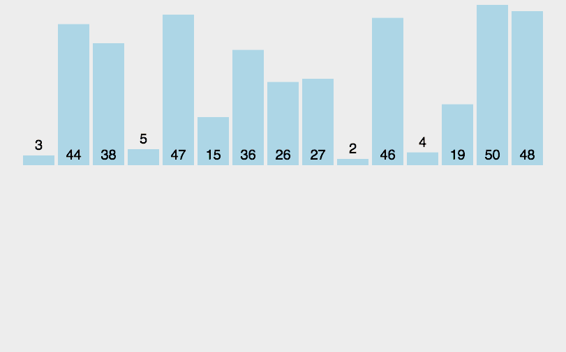

# 排序算法

## 简介

排序算法比较多，重点掌握：快速排序、选择排序、希尔排序、冒泡排序这四种即可。

> 稳定 ：如果a原本在b前面，而a=b，排序之后a仍然在b的前面；  <br>
> 不稳定 ：如果a原本在b的前面，而a=b，排序之后a可能会出现在b的后面；    <br>
> 内排序 ：所有排序操作都在内存中完成； <br>
> 外排序 ：由于数据太大，因此把数据放在磁盘中，而排序通过磁盘和内存的数据传输才能进行； <br>
> 时间复杂度 ： 一个算法执行所耗费的时间。  <br>
> 空间复杂度 ：运行完一个程序所需内存的大小。   <br>


## 冒泡排序

- 比较相邻的元素。如果第一个比第二个大，就交换他们两个。
- 对每一对相邻元素作同样的工作，从开始第一对到结尾的最后一对。这步做完后，最后的元素会是最大的数。
- 针对所有的元素重复以上的步骤，到最后一步默认为最大了, 所以`len-1`。
- 持续每次对越来越少的元素重复上面的步骤，直到没有任何一对数字需要比较。

动图演示：


代码实现：
```js
function bubbleSort(arr) {
    let len = arr.length;
    for (let i = 0; i < len - 1; i++) {
        for (let j = 0; j < len - 1 - i; j++) {
            if (arr[j] > arr[j+1]) {        // 相邻元素两两对比
                [arr[j], arr[j+1]] = [arr[j+1], arr[j]]
            }
        }
    }
    return arr;
}
```

## 选择排序
- 首先在未排序序列中找到最小（大）元素，存放到排序序列的起始位置
- 再从剩余未排序元素中继续寻找最小（大）元素，然后放到已排序序列的末尾。
- 重复第二步，直到所有元素均排序完毕。

动图演示：


代码实现：
```js
function selectionSort(arr) {
    let len = arr.length;
    let minIndex;
    for (let i = 0; i < len - 1; i++) {
        minIndex = i;
        for (let j = i + 1; j < len; j++) {
            if (arr[j] < arr[minIndex]) {     // 寻找最小的数
                minIndex = j;                 // 记录最小数索引
            }
        }
        [arr[minIndex], arr[i]] = [arr[i], arr[minIndex]]
    }
    return arr;
}
```
简单说一下
- 外层循环的i表示第几轮，`arr[i]`就表示当前轮次最靠前(小)的位置
- 内层从`i`开始，依次往后数，找到比开头小的，互换位置即可


## 插入排序
就像打扑克一样，依次将拿到的元素插入到正确的位置即可。
- 首先将待排序的第一个记录作为一个有序段
- 内层循环, 都会把当前值跟前面值进行比较, 再互换位置
- 如果当前值大于前面值, 说明前面是有序段, 则退出循环, 确定插入位置

动图演示：


代码实现：

```js
function insertSort(arr) {
    for(let i = 1; i < arr.length; i++) {   // 外循环从1开始，默认arr[0]是有序段
        for(let j = i; j > 0; j--) {        // j = i,将arr[j]依次插入有序段中
            if(arr[j] < arr[j-1]) {
                [arr[j], arr[j-1]] = [arr[j-1], arr[j]];
            } else {
                break; // 证明有序，退出循环
            }
        }
    }
    return arr;
}
```
分析： 注意这里两次循环中，`i`和`j`的含义：

1. `i`是外循环，依次把后面的数插入前面的有序序列中，默认`arr[0]`为有序的，i就从1开始
2. `j`进来后，依次与前面队列的数进行比较，因为前面的序列是有序的，因此只需要循环比较、交换即可
3. 注意这里的`break`，因为前面是都是有序的序列，所以如果当前要插入的值`arr[j]`大于或等于`arr[j-1]`，则无需继续比较，直接下一次循环就可以了。

## 归并排序

归并排序是一种`分而治之算法`

其思想是将原始数组切分成较小的数组，直到每个小数组只有一个位置，接着将小数组归并成较大的数组，直到最后只有一个排序完毕的大数组。



```js
function mergeSort(arr) {
    let len = arr.length
    if (len < 2) {      // 停止条件, 并返回
        return arr
    }
    // 以数组长度的中位数, 划分成两个数组 (分治法)
    let middle = Math.floor(len / 2),
        left = arr.slice(0, middle),
        right = arr.slice(middle);

    // 递归合并两边数组
    return merge(mergeSort(left), mergeSort(right))
}

function merge(left, right) {    
    const result = []
    // 清空其中一个数组
    while (left.length && right.length) {
        if (left[0] <= right[0]) {
            result.push(left.shift())
        } else {
            result.push(right.shift())
        }
    }
    // 剩下一个数组为排序状态, 直接push即可
    while (left.length) {
        result.push(left.shift())
    }
    while (right.length) {
        result.push(right.shift())
    }
    return result
}
```

看不懂的话, 可以运行 Github 同一个目录下的排序HTML文件, 看着`log`打印的值, 需要明白`递归`是什么

归并排序与快速排序都是用递归来实现的算法, 都是分分合合的过程。区别在于归并排序在合的过程中进行排序, 快速排序则在分的过程中进行排序。另外它们的时间复杂度都为 O(nlogn)。

## 快速排序

快速排序可以说是对于前端最最最最重要的排序算法，没有之一了，面试官问到排序算法，快排的概率能有80%以上(我瞎统计的...信不信由你)。

所以快排是什么呢？

> 快排是处理大数据最快的排序算法之一。它是一种**分而治之**的算法，通过递归的方式将数据依次分解为包含较小元素和较大元素的不同子序列。该算法不断重复这个步骤直至所有数据都是有序的。


动图演示：


代码实现：

```js
// 取数组第一个值为基准值，把比它小的放a数组，大的放b数组。
function quickSort(arr) {
    if (arr.length <= 1) {
        return arr;  //递归出口
    }
    var left = [],
        right = [],

        // 1. 注意splice后，数组长度少了一个
        current = arr.splice(0, 1);         

        // 2. 取中间值
        // middle = Math.floor((arr.length - 1) / 2) 
        // current = arr[middle]
        
    for (let i = 0; i < arr.length; i++) {
        arr[i] < current ? left.push(arr[i]) : right.push(arr[i]);
    }

    return quickSort(left).concat(current, quickSort(right)); //递归
}
```

快速排序算法非常适用于大型数据集合；在处理小数据集时性能反而会下降。

归并排序与快速排序都是用递归来实现的算法, 都是分分合合的过程。区别在于归并排序在合的过程中进行排序, 快速排序则在分的过程中进行排序。另外它们的时间复杂度都为 O(nlogn)。

