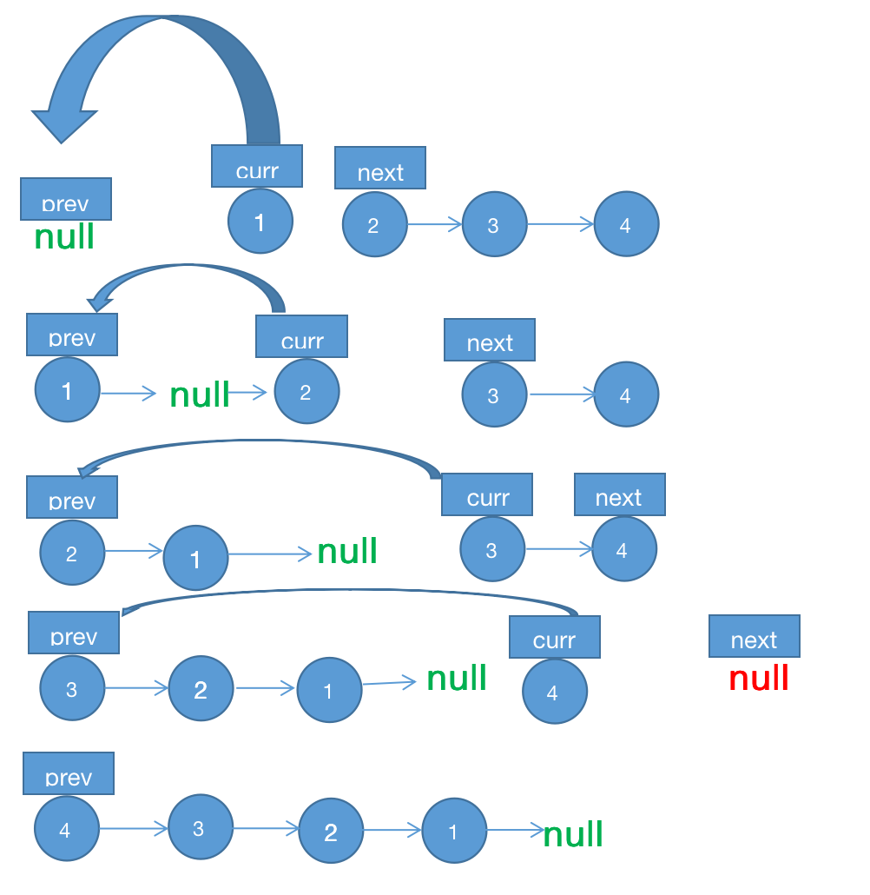
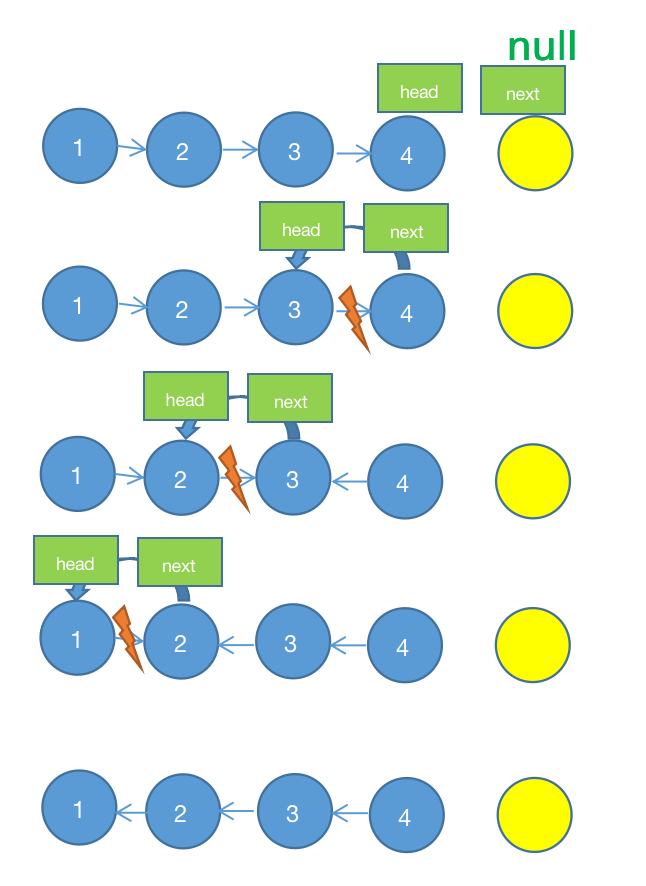

# 链表

## 反转链表


反转一个单链表。

```js
输入: 1->2->3->4->5->NULL
输出: 5->4->3->2->1->NULL
```

解法一：迭代

- 时间复杂度: O(n)
- 空间复杂度: O(1)

```js
function Node(key) {
    this.key = key;
    this.next = null;
}
/**
 * @param {ListNode} head
 * @return {ListNode}
 */
const reverseList = (head) => {
    if (!head) {
        return null
    }
    let prev = null, curr = head;
    while (curr) {
        let next = curr.next
        curr.next = prev
        prev = curr
        curr = next
        // [curr.next, prev, curr] = [prev, curr, curr.next]
    }
    return prev
}
```

- 设置哨兵节点 `null`, 初始化当前节点 `curr` 为 `head`
- 将当前节点 `curr` 的指针指向上一个节点 `prev`
- 更新上一个节点 `prev` 为当前节点 `curr`
- 更新当前节点 `curr` 为下一个节点 `next`
- 重复以上动作直到当前节点为尾节点的节点 `null`



解法二: 尾递归

其实就是解法一的简化版

- 时间复杂度: O(n)
- 空间复杂度: O(1)

```js
const reverseList = (head) => {
    let reverse = (prev, curr) => {
        if (!curr) return prev
        let next = curr.next
        curr.next = prev
        return reverse(curr, next)
    }
    return reverse(null, head)
}
```

解法三: 递归

不断递归反转当前节点 `head` 的后继节点 `next`

- 时间复杂度: O(n)
- 空间复杂度: O(n)

```js
const reverseList = (head) => {
    if (!head || !head.next) return head
    let next = head.next
    // 递归反转
    let reverse = reverseList(next)
    // 变更指针
    head.next = null
    next.next = head
    return reverse
}
```

- 当前节点 `head`，下一个节点 `next`
- 将 `head` 的指针断开，把 `head.next` 指向 `head`，即是反转
- 由编译器函数调用执行栈原理可知，最先调用的函数会在递归过程中最后被执行，而最后调用的会最先执行
- 因此此题，最先返回最后两个节点开始反转操作，依次从后面两两节点开始反转

