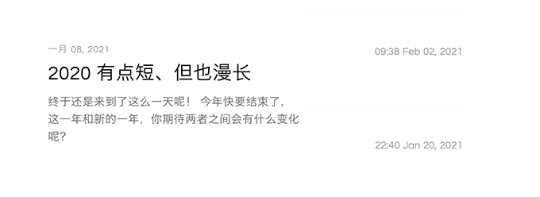

# JS日期、年月日、时分秒的无敌秘籍，文艺之行

JS中的日期时间应用场景是非常广阔的，比如说：页面监控、评论提交、文章发布、内容编辑、节日活动等等，有生命的地方就存在时间。

这里汇总了所有常见转换以及无敌的操作，以后再也不用去百度一顿搜索了，直接来这里（CTRL+C）


## 当前标准时间

先来获取一下当前的标准时间，参数为指定字符，位置可随意，传啥有啥！

```js
function format(fmt) {
    const date = new Date()
    const o = {
        "Y+": date.getFullYear(),
        "M+": date.getMonth() + 1,     // 月
        "D+": date.getDate(),          // 日
        "h+": date.getHours(),         // 时
        "m+": date.getMinutes(),       // 分
        "s+": date.getSeconds(),       // 秒
        "W": date.getDay()             // 周
    }
    for (var k in o) {
       if (new RegExp("("+ k +")").test(fmt)) {
            fmt = fmt.replace(RegExp.$1, () => {
                if (k === 'W') {                                    // 星期几
                    const week = ['日', '一', '二', '三', '四', '五', '六']
                    return week[o[k]]
                } else if (k === 'Y+' || RegExp.$1.length == 1) {    // 年份 or 小于10不加0
                    return o[k]
                } else {
                    return ("00"+ o[k]).substr(("" + o[k]).length)  // 小于10补位0
                }
            })
        }
    }
    return fmt
}
format('星期W')                  // 星期日
format("YYYY-MM-DD hh:mm:ss")   // 2021-03-21 20:24:32
format("MM/DD/YYYY hh:mm")      // 03-21-2021 20:24
format("MM/DD/YYYY hh:mm")      // 03-21-2021 20:24 
format("YYYY年MM月DD日 hh:mm:ss 星期W") // 2021年03月21日 20:30:14 星期日
```

扩展性较强，可根据所需结构来使用和修改！

## 时间戳转换

我们在数据库存储时间字段的时候，一般都会以时间戳的标准来存储。

在前端展示的时候，又该怎样让它变成一个正常的时间呢！

首先来获取一下当前的时间戳，有以下三种方式：

```js
new Date().getTime()    // 精确到毫秒
new Date().valueOf()    // 精确到毫秒
Date.parse(new Date())  // 精确到秒

// 第一个得到：1616330071538
```

我们接着改造上面的方法：

```js
function format(fmt, timestamp) {
    const date = timestamp ? new Date(timestamp) : new Date()
    // ....
}
const a = format("YYYY-MM-DD hh:mm:ss")
const b = format("YYYY年MM月DD日 hh:mm:ss 周W", 1616330071538)
// a: 2021-03-21 20:48:30
// b: 2021年03月21日 20:34:31 周日
```

再添加一个时间戳的参数，只需把时间戳传进日期对象即可。


## 在很久以前

很久以前如果我们不曾相遇，如果没人说出那些话，那我们现在还会不会是朋友。偶然看到我们的聊天记录，时间停留在去年的某一个冬天，最后的信息让手机冷了心！

如果能像计算器一样归零，那么你是否会选择重新开始？

```js
const time = (timestemp) => {
    const minute = 1000 * 60;
    const hour = minute * 60;
    const day = hour * 24;
    const month = day * 30;
    const year = month * 12;
    const diffValue = new Date().getTime() - timestemp; // 当前时间戳-原时间戳=相差时间

    // 如果本地时间小于变量时间
    if (diffValue <= 0) {
        return '现在'
    }

    // 计算差异时间的量级
    const yearC = diffValue / year;
    const monthC = diffValue / month;
    const weekC = diffValue / (7 * day);
    const dayC = diffValue / day;
    const hourC = diffValue / hour;
    const minC = diffValue / minute;

    // 从大到小排序 满足1以上即成立
    const map = {
        [yearC]: '年',
        [monthC]: "月",
        [weekC]: "周",
        [dayC]: "天",
        [hourC]: "小时",
        [minC]: "分钟",
    }
    for (let i in map) {
        if (i >= 1) {
            return `${parseInt(i)}${map[i]}前`
        }
    }
}
time(new Date().getTime()                // 现在
time(new Date('2021-1-11').getTime()     // 2月前
time(new Date('2021-2-22').getTime()     // 3周前
time(new Date('2020-3-11').getTime()     // 1年前
time(new Date('2019-3-11').getTime()     // 2年前
time(new Date(1616330071538).getTime()   // 1小时前
```

我们看到的朋友圈、留言评论、文章等，大部分会以相对时间来显示，这时候就需要前端进行实时处理了。

## 时间的范围

一个常见的场景：我们在网上买东西，都会有一个咨询客服的功能，当然客服也有上下班时间的，那么我们应该怎么判断当前时间是否在服务时间内呢。

例如：客服上班时间（08:00-20:00）（08:30-20:30）

```js
// 第一种 很简单
function time(beginTime, endTime){
    const timeNow = new Date().getHours()
    return timeNow >= beginTime && timeNow < endTime
}
time(8, 20)

// 第二种 升级版
function times(beginTime, endTime){
    const bDate = beginTime.split(':')
    const eDate = endTime.split(':')
    
    const o = {}
    const s = ['nDate', 'bDate', 'eDate']

    for (let i of s) {
        o[i] = new Date()
        let hours, minute;
        if (i == 'nDate') {
            hours = o[i].getHours()
            minute = o[i].getMinutes()
        } else {
            const arr = i == 'bDate' ? bDate : eDate
            hours = arr[0]
            minute = arr[1] || 0
        }
        o[i].setHours(hours)
        o[i].setMinutes(minute)
    }
    // 当前、开始、结束，三者的时间戳进行对比，答案就很清晰明了
    return o.nDate.getTime() - o.bDate.getTime() > 0 && o.nDate.getTime() - o.eDate.getTime() < 0
}
// 两种都支持
console.log(times('8', '22'))
console.log(times('8:30', '22:54'))
```

重点为第二种，因为有分秒等判断操作，会比只判断时间更加复杂，最优的方式就是把关联性的时间各自转换成时间戳，再统一计算！（几年级的题？？

## 前后七天日期

根据前一天的日期依次递增，从而得到指定日期数组。

```js
// 后七天日期
function getAfterDate(){
    let date = new Date().getTime(), 
        result = [], 
        newDate, 
        month, 
        day;
    for (let i = 1; i < 8; i++) {
        newDate = date + i * 24 * 60 * 60 * 1000
        month = new Date(newDate).getMonth() + 1
        day = new Date(newDate).getDate()
        result.push(month + '-' + day)
    }
    return result
}
// ['3-23', '3-24', '3-25', '3-26', '3-27', '3-28', '3-29']
```

```js
// 前七天日期
function getBeforeDate(){
    let date = new Date().getTime(), 
        result = [], 
        newDate, 
        month, 
        day;
    for (let i = 7; i > 0; i--) {
        newDate = date - i * 24 * 60 * 60 * 1000
        month = new Date(newDate).getMonth() + 1
        day = new Date(newDate).getDate()
        result.push(month + '-' + day)
    }
    return result
}
// ['3-15', '3-16', '3-17', '3-18', '3-19', '3-20', '3-21']
```

## 是否七天内日期

限制选择日期的长度，比如`Element-UI`里面的日期选择器，限制只可选择七天内的日期。

```js
/**
 * @param {String} tcimestamp => '2020-05-08 19:46'
 */
function a (timestamp) {
    timestamp = new Date(timestamp).getTime()
    const endTime = 24 * 60 * 60 * 1000 * 7
    const currentTime = new Date().setHours(0, 0, 0, 0)
    return currentTime <= timestamp && currentTime + endTime > timestamp
}

console.log(a('2021-3-23')) // true
console.log(a('2021-3-29')) // true
console.log(a('2021-3-30')) // false
```

- endTime：计算出7天的时间戳
- currentTime：把当天的时间设置为0点

接着，回到上上步，客服上班的计算方式了！


## 无敌且文艺、随意搭配

在我的个人网站上，用了以下的日期显示方式，会比正常的时间更有亮点，且有个性范！



```js
/**
 * @param {String} tcimestamp => '2020-05-08 19:46'
 */
function dateFormat(timestamp) {
    const w = new Date(timestamp).getDay()  // 获取周

    // 解析时间为数组
    timestamp = timestamp.toString().replace(/-|\:|\/|\ /g, ',').split(',')
    
    const week = ['日', '一', '二', '三', '四', '五', '六']
    const month = ['一', '二', '三', '四', '五', '六', '七', '八', '九', '十', '十一', '十二']
    const weekEn = ['Sunday', 'Monday', 'Tuesday', 'Wednesday', 'Thursday', 'Friday', 'Saturday']
    const monthEn = ['Jan', 'Feb', 'Mar', 'Apr', 'May', 'Jun', 'Jul', 'Aug', 'Sept', 'Oct', 'Nov', 'Dec']
    const opt = ['Y', 'M', 'D', 'h', 'm', 'W'].reduce((t, v, i) => {
        t[v] = v === 'W' ? w : timestamp[i]
        return t
    }, {})

    // 日
    let st = 'st',
        nd = 'nd',
        rd = 'rd',
        th = 'th',
        obj = {
            1: st,
            2: nd,
            3: rd,
            21: st,
            22: nd,
            23: rd,
            31: st
        };

    let day = opt.D + (obj[opt.D] ? obj[opt.D] : th)
    day = day.startsWith(0) ? day.slice(1) : day    // 去除前面的0

    const time = {
        date: `${opt.Y}/${opt.M}/${opt.D} ${opt.h}:${opt.m}`,
        time: `${opt.h}:${opt.m}`,
        year: opt.Y,
        month: {
            on: opt.M,
            cn: month[Number(opt.M) - 1],
            en: monthEn[Number(opt.M) - 1]
        },
        day: {
            on: opt.D,
            en: day
        },
        week: {
            on: week[opt.W],
            en: weekEn[opt.W]
        }
    }
    return time
}
console.log(dateFormat('2020-05-08 19:46'))
```

```js
{
    date: '2020/05/30 19:46',
    time: '19:46',
    year: '2020',
    month: { on: '05', cn: '五', en: 'May' },
    day: { on: '08', en: '8th' },
    week: { on: '五', en: 'Friday' }
}
```

多了一些更多的选择，也让你所展示的时间更加多样化，丰富多彩。彰显出属于你独特的风格！