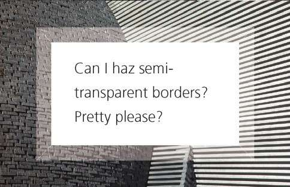
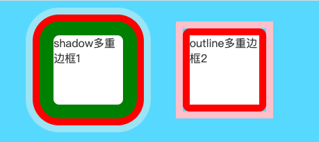

# CSS 揭秘

CSS对于前端还是非常非常重要的, 毕竟这是视觉体验最主要的实现, 切图仔的JS可以差, 但CSS还差的话, 那你就等着失业吧

CSS跟设计有深度联系, 做为一个好的前端, 一定要有较好的审美观, 和设计功底(强迫症), 一个产品的用户体验完全取决于你的CSS与设计能力

现在的CSS已经非常强大了, 减少了大部分JS代码和元素所需的背景图片等等

CSS揭秘这本书, 有很多奇淫技巧值得学习, 下面我们都来看看吧

## 边框与背景

### 半透明边框

主要实现为`background-clip`属性, 这个属性的初始值是`border-box`，意味着背景会被元素的border box（边框的外沿框）裁切掉。

如果不希望背景侵入边框所在的范围, 我们要做的就是把它的值设为`padding-box`，这样浏览器就会用内边距的外沿来把背景裁切掉。

使用伪元素`before`&`after`进行定位操作, 也可实现透明边框方法

```css
{
    background: #fff;
    background-clip: padding-box;
    border: 20px solid rgba(238, 238, 238, 0.4);
}
```



### 多重边框

box-shadow 实现:

```css
{
    /* 一重 */
    box-shadow: 0 0 0 20px green;
    /* 多重 */
    box-shadow: 0 0 0 20px green, 
                0 0 0 30px red, 
                0 0 0 40px rgba(253, 245, 230, 0.4);
}
```

多重投影解决方案在绝大多数场合都可以很好地工作，但有一些注意事项。

- 投影的行为跟边框不完全一致，因为它不会影响布局，而且也不会受到`box-sizing`属性的影响。
不过，你还是可以通过内边距或外边距（这取决于投影是内嵌和还是外扩的）来额外模拟出边框所需要占据的空间。

- 上述方法所创建出的假“边框”出现在元素的外圈。它们并不会响应鼠标事件，比如悬停或点击。
如果这一点非常重要，你可以给`box-shadow`属性加上inset关键字，来使投影绘制在元素的内圈。
请注意，此时你需要增加额外的内边距来腾出足够的空隙。

outline 实现:

这种方法的一大优点在于边框样式十分灵活，不像上面的`box-shadow`方案只能模拟实线边框（假设我们需要产生虚线边框效果，`box-shadow`就没辙了）

```css
{
    border: 10px solid red;
    outline: 10px solid pink;
}
```

注意点: 通过outline属性实现的“边框”不会贴合元素的圆角




### 灵活的背景定位

### 边框内圆角

### 条纹背景

### 复杂的背景图案

### 伪随机背景

### 连续的图像边框


## 形状

### 自适应的椭圆

### 平行四边形


### 菱形图片


### 切角效果


### 梯形标签页


### 简单的饼图


## 视觉效果

### 单侧投影

### 不规则投影

### 染色效果

### 毛玻璃效果

### 折角效果


## 字体排印

## 用户体验

## 结构与布局

## 过渡与动画


