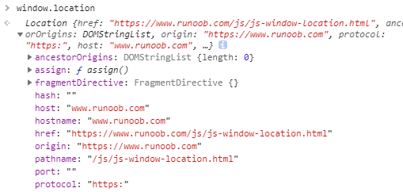

# BOM 浏览器事件

## 窗口事件

```js
window.innerHeight // 浏览器窗口的高度(包括滚动条)
window.innerHeight // 浏览器窗口的高度(包括滚动条)

// 页面事件

window.onfocus // 监听进入页面
window.onblur  // 监听离开页面

visibilitychange   // 隐藏或显示页面、触发该事件
```

两种方法实现页面切换时、更改标签title

```js
// one
window.onfocus = function () {
	document.title = '要走的人终究是留不住~~';
	setTimeout(function(){
		document.title = '夜雨绸缪';
	}, 1500);
}
window.onblur = function () {
	document.title = '等等，你别走啊！！';
}

// two
document.addEventListener('visibilitychange',function(){
    if( document.visibilityState == 'hidden' ){
        normal_title = document.title;
        document.title = '梦里花落知多少 ^_^ ~ ~';
    }else{
        document.title = '永远相信美好的事情即将发生';
        setTimeout(function(){
            document.title = normal_title;
        }, 1200)
    }
})
```

## location

对象用于获得当前页面的地址 (URL)，并把浏览器重定向到新的页面。

常见的参数如下图



来获取 url 参数的解析

```js
// https://raindays.cn?name=libai&age=20&job=teacher
function urlParse(url) {
    const res = new Object();
    const arr = url.substr(url.indexOf('?') + 1).split('&');
    arr.forEach(item => {
        let tmp = item.split('=');
        res[tmp[0]] = tmp[1]
    })
    return res
}
```
