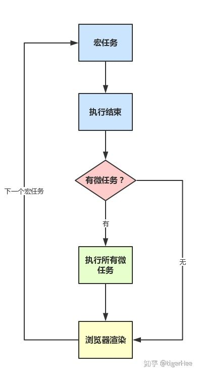
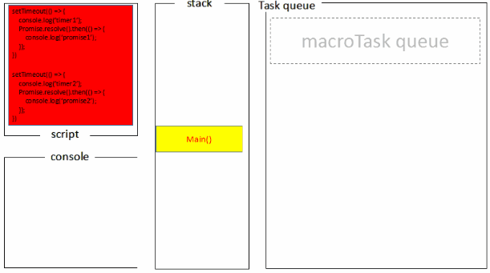

# 运行机制

掌握下面几个要点：

- JS 的单线程概念
- 任务队列
- EventLoop
- 哪些语句会放入异步任务队列
- 语句放入异步任务队列的时机

## 为什么 JavaScript 是单线程

**JavaScript语言的一大特点就是单线程，也就是说，同一个时间只能做一件事。**

那么，为什么JavaScript不能有多个线程呢？这样能提高效率啊。

JavaScript的单线程，与它的用途有关。作为浏览器脚本语言，JavaScript的主要用途是与用户互动，以及操作DOM。

这决定了它只能是单线程，否则会带来很复杂的同步问题。

**比如，假定JavaScript同时有两个线程，一个线程在某个DOM节点上添加内容，另一个线程删除了这个节点，这时浏览器应该以哪个线程为准？**

所以，为了避免复杂性，从一诞生，JavaScript就是单线程，这已经成了这门语言的核心特征，将来也不会改变。

为了利用多核CPU的计算能力，HTML5提出Web Worker标准，允许JavaScript脚本创建多个线程，但是子线程完全受主线程控制，且不得操作DOM。

所以，这个新标准并没有改变JavaScript单线程的本质。

## 任务队列

单线程就意味着，所有任务需要排队，前一个任务结束，才会执行后一个任务。

**所有任务可以分成两种：**

- `同步任务`：在主线程上排队执行的任务，只有前一个任务执行完毕，才能执行后一个任务；
- `异步任务`：不进入主线程、而进入"任务队列"（task queue）的任务，只有"任务队列"通知主线程，某个异步任务可以执行了，该任务才会进入主线程执行。

整个执行过程，我们称为事件循环过程。

## 同步任务、异步任务

- JS分为同步任务和异步任务
- 同步任务都在主线程上执行，形成一个执行栈
- 主线程之外，事件触发线程管理着一个任务队列，只要异步任务有了运行结果，就在任务队列之中放置一个事件。
- 一旦执行栈中的所有同步任务执行完毕（此时JS引擎空闲），系统就会读取任务队列，将可运行的异步任务添加到可执行栈中，开始执行。


## 宏任务、微任务

异步任务被分为两种，一种宏任务（`MacroTask`）也叫`Task`，一种叫微任务（`MicroTask`）。

**MacroTask** 大概包括：

- setTimeout
- setInterval
- setImmediate (Node独有)
- requestAnimationFrame (浏览器独有)
- I/O
- UI Rendering (浏览器独有)

**microtask** 大概包括：

- Promise（事件处理为同步任务，回调为微任务）
- Async/Await (实际就是promise)
- process.nextTick (Node独有)
- MutationObserver (html5新特性)

> 关于process.nextTick的一点说明，`process.nextTick`是一个独立于`eventLoop`的任务队列。 <br >
> 在每一个`eventLoop`阶段完成后会去检查这个队列，如果里面有任务，会让这部分任务**优先于其他微任务执行**。



## 例子知晓一切

```js
console.log('script start');

setTimeout(function() {
  console.log('setTimeout');
}, 0);

Promise.resolve().then(function() {
  console.log('promise1');
}).then(function() {
  console.log('promise2');
});
console.log('script end');
```

首先我们划分几个分类：

### 第一次执行

```js
Tasks：run script、 setTimeout callback

Microtasks：Promise then	

JS stack: script	
Log: script start、script end。
```

执行同步代码，将宏任务（`Tasks`）和微任务(`Microtasks`)划分到各自队列中。

### 第二次执行

```js
Tasks：run script、 setTimeout callback

Microtasks：Promise2 then	

JS stack: Promise2 callback	
Log: script start、script end、promise1、promise2
```

执行宏任务后，检测到微任务(`Microtasks`)队列中不为空，执行`Promise1`，执行完成`Promise1`后，调用`Promise2.then`，放入微任务(`Microtasks`)队列中，再执行`Promise2.then`。

### 第三次执行

```js
Tasks：setTimeout callback

Microtasks：	

JS stack: setTimeout callback
Log: script start、script end、promise1、promise2、setTimeout
```

当微任务(`Microtasks`)队列中为空时，执行宏任务（`Tasks`），执行`setTimeout callback`，打印日志。

### 第四次执行

```js
Tasks：setTimeout callback

Microtasks：	

JS stack: 
Log: script start、script end、promise1、promise2、setTimeout
```

清空`Tasks`队列和`JS stack`。

以上执行帧动画可以查看 [Tasks, microtasks, queues and schedules](https://jakearchibald.com/2015/tasks-microtasks-queues-and-schedules/?_blank)

或许这张图也更好理解些。




在执行宏任务的过程中会不断的有微任务加入到微任务队列中，当执行完一个宏任务后先看微任务队列里有没有微任务，如果有先把整队的微任务执行完，然后在执行下一个宏任务，如此以往形成event loop。

**也就是说，执行微任务的前提是同步任务都完成，执行宏任务的前提是微任务队列都清空。**


## 再来练习练习

```js
setTimeout(() => console.log(4))

new Promise(resolve => {
    resolve()
    console.log(1)
}).then(() => {
    console.log(3)
    Promise.resolve().then(() => {
        console.log('before timeout')
    }).then(() => {
        Promise.resolve().then(() => {
            console.log('also before timeout')
        })
    })
})

console.log(2)

// 1, 2, 3, 'before timeout', 'also before timeout', 4
```

```js
console.log('1');

setTimeout(function() {
    console.log('2');
    process.nextTick(function() {
        console.log('3');
    })
    new Promise(function(resolve) {
        console.log('4');
        resolve();
    }).then(function() {
        console.log('5')
    })
})
new Promise(function(resolve) {
    console.log('7');
    resolve();
}).then(function() {
    console.log('8')
})
process.nextTick(function() {
    console.log('6');
})
setTimeout(function() {
    console.log('9');
    process.nextTick(function() {
        console.log('10');
    })
    new Promise(function(resolve) {
        console.log('11');
        resolve();
    }).then(function() {
        console.log('12')
    })
})

// 1，7，6，8，2，4，3，5，9，11，10，12
```

几乎涵盖基本情况的例子:

```js
console.log('1');

new Promise(resolve => {
    console.log('2');
    resolve();
}).then(() => {
    console.log('3');
    setTimeout(() => {
        console.log('4');
    }, 0);
})

console.log('5');

setTimeout(() => {
    console.log('6');
    new Promise(resolve => {
        console.log('7');
        resolve();
    }).then(() => {
        console.log('8');
    })
    console.log('9');
    setTimeout(() => {
        console.log('10');
    }, 0);
}, 0);

new Promise(resolve => {
    console.log('11');
    resolve();
}).then(() => {
    console.log('12');
})

console.log('13');

// 1, 2, 5, 11, 13, 3, 12, 6, 7, 9, 8, 4, 10
```

## 出现async/await

**await 语句是同步的，await语句后面全部代码才是异步的微任务，**

一旦遇到await，就立刻让出线程，阻塞后面的代码，对于await来说分两种情况

- 是 promise 对象
- 不是 promise 对象

```js
async function async1() {
    console.log(1) 
    await async2()
    console.log(2)
}
async function async2() {
    console.log(3)
}
console.log(4)
setTimeout(() => {
    console.log(5)
}, 0 )
async1();
new Promise(( resolve ) => {
    console.log(6)
    resolve();
}).then(() => {
    console.log(7) 
})
console.log(8)

// 4, 1. 3, 6, 8, 2, 7, 5
```

区分await后执行promise和非promise的区别

```js
async function t1 () {
    console.log(1)
    new Promise((resolve) => {
        console.log(2)
        resolve();
    } ).then( function () {
        console.log(3)
    })
    await new Promise((resolve) => {
        console.log(4)
        resolve();
    } ).then(() => {
        console.log(5)
    } )
    console.log(6)
    new Promise((resolve) => {
        console.log(7)
        resolve();
    }).then(() => {
        console.log(8)
    })
}

setTimeout(() => {
    console.log(9)
}, 0 )

async function t2() {
    console.log(10)
    await Promise.resolve().then(() => console.log(11))
    console.log(12)
}
t1()
new Promise((resolve) => {
    console.log(13)
    resolve();
}).then(() => {
    console.log(14)
})
t2()

console.log(15);

// 1, 2, 4, 13, 10, 15, 3, 5, 14, 11, 6, 7, 12, 8, 9
```

`await`之后的代码必须等`await`语句执行完成后（包括微任务完成），才能执行后面的，也就是说，**只有运行完`await`语句，才把`await`语句后面的全部代码加入到微任务行列**，所以，在遇到`await`和`promise`时，必须等`await` `promise`函数执行完毕才能对`await`语句后面的全部代码加入到微任务中。

从另一个角度来讲也可以说是嵌套的微任务。

## 浏览器 与 Node 差异

这里主要说明的是 `node11` 前后的差异，因为 `node11` 之后一些特性已经向浏览器看齐了，总的变化一句话来说就是，如果是 `node11` 版本之后的一旦执行一个阶段里的一个宏任务(setTimeout,setInterval和setImmediate)就立刻执行对应的微任务队列，一起来看看吧～

### 1. timers 阶段的执行时机变化

```js
setTimeout(()=>{
    console.log('timer1')
    Promise.resolve().then(function() {
        console.log('promise1')
    })
}, 0)
setTimeout(()=>{
    console.log('timer2')
    Promise.resolve().then(function() {
        console.log('promise2')
    })
}, 0)
```

- 如果是 `node11` 版本一旦执行一个阶段里的一个宏任务就立刻执行微任务队列，这就跟浏览器端运行一致，最后的结果为 `timer1=>promise1=>timer2=>promise2`
- 如果是 `node10` 及其之前版本要看第一个定时器执行完，第二个定时器是否在完成队列中.
    - 如果是第二个定时器还未在完成队列中，最后的结果为 `timer1=>promise1=>timer2=>promise2`
    - 如果是第二个定时器已经在完成队列中，最后的结果为 `timer1=>timer2=>promise1=>promise2`


看看三元大佬的解释：

> 若第一个定时器任务出队并执行完，发现队首的任务仍然是一个定时器，那么就将微任务暂时保存，直接去执行新的定时器任务，当新的定时器任务执行完后，再一一执行中途产生的微任务。

### 2. check 阶段的执行时机变化

```js
setImmediate(() => console.log('immediate1'));
setImmediate(() => {
    console.log('immediate2')
    Promise.resolve().then(() => console.log('promise resolve'))
});
setImmediate(() => console.log('immediate3'));
setImmediate(() => console.log('immediate4'));
```

- 如果是 node11 后的版本，会输出 `immediate1=>immediate2=>promise resolve=>immediate3=>immediate4`
- 如果是 node11 前的版本，会输出 `immediate1=>immediate2=>immediate3=>immediate4=>promise resolve`

### 3. nextTick 队列的执行时机变化

```js
setImmediate(() => console.log('timeout1'));
setImmediate(() => {
    console.log('timeout2')
    process.nextTick(() => console.log('next tick'))
});
setImmediate(() => console.log('timeout3'));
setImmediate(() => console.log('timeout4'));
```

- 如果是 node11 后的版本，会输出 `timeout1=>timeout2=>next tick=>timeout3=>timeout4`
- 如果是 node11 前的版本，会输出 `timeout1=>timeout2=>timeout3=>timeout4=>next tick`

以上几个例子，你应该就能清晰感受到它的变化了，反正记着一个结论。

**如果是 node11 版本一旦执行一个阶段里的一个宏任务就立刻执行对应的微任务队列。**

**两者最主要的区别在于浏览器中的微任务是在`每个相应的宏任务`完成后执行的，而node中的微任务是在`不同阶段之间`执行的。**

- [【语音解题系列】说说Node的事件循环机制](https://mp.weixin.qq.com/s/qEmR-N6cANSkKuJt2QO_eg)
- [006: 如何理解EventLoop——nodejs篇](http://47.98.159.95/my_blog/js-v8/006.html)

## 参考

- [这一次，彻底弄懂 JavaScript 执行机制](https://juejin.im/post/59e85eebf265da430d571f89#heading-0?_blank)
- [一次弄懂Event Loop（彻底解决此类面试问题）](https://juejin.im/post/5c3d8956e51d4511dc72c200#heading-36?_blank)