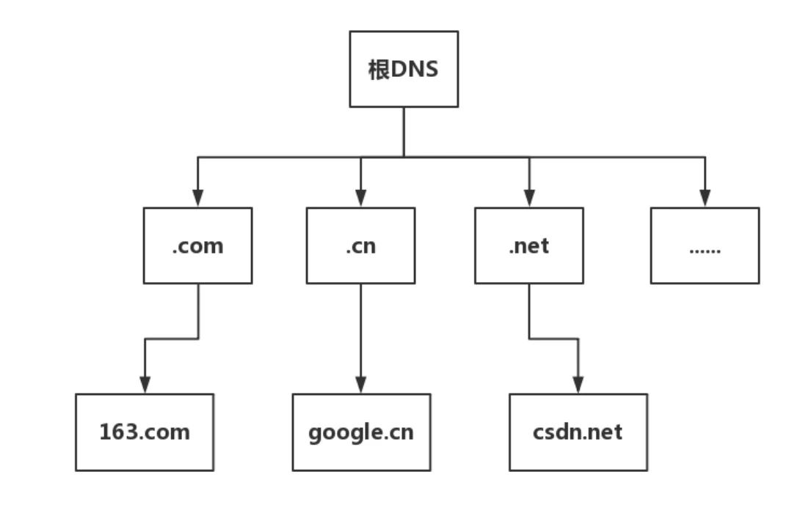
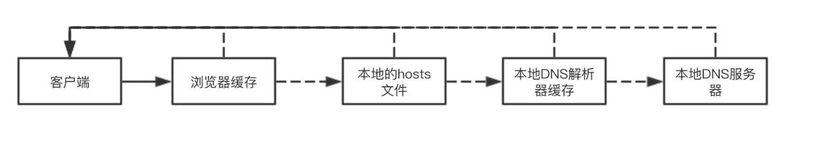
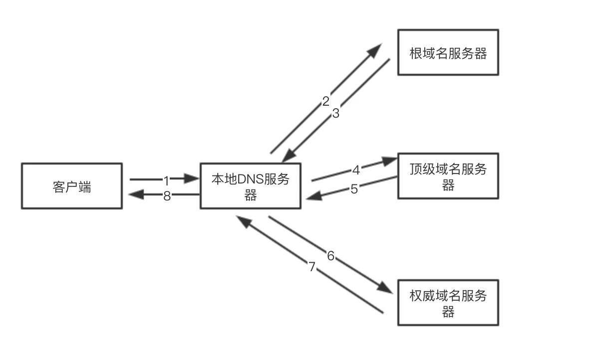
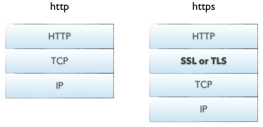
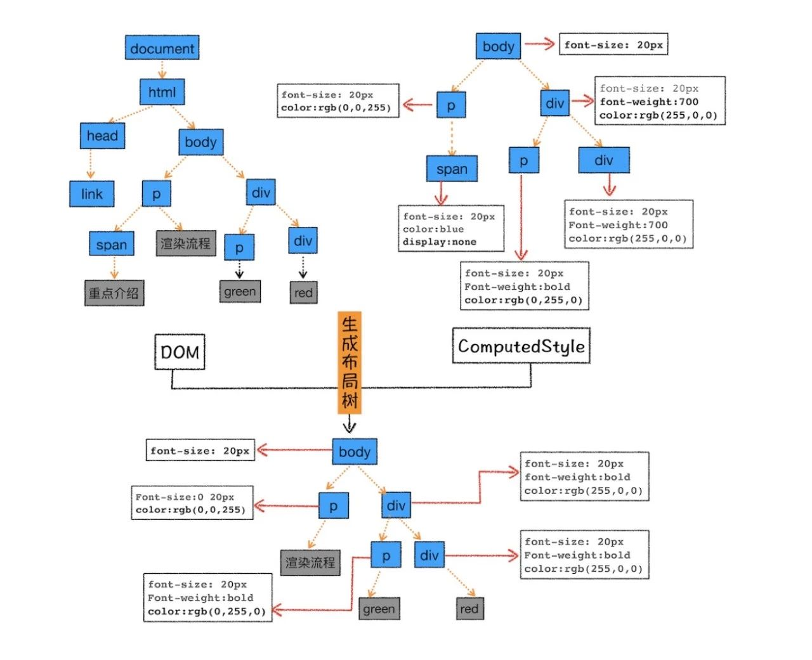
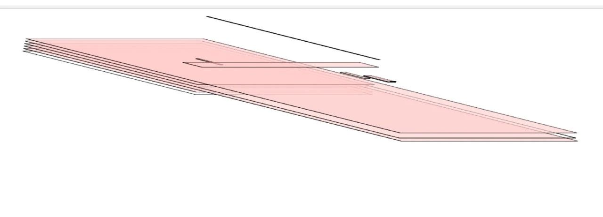
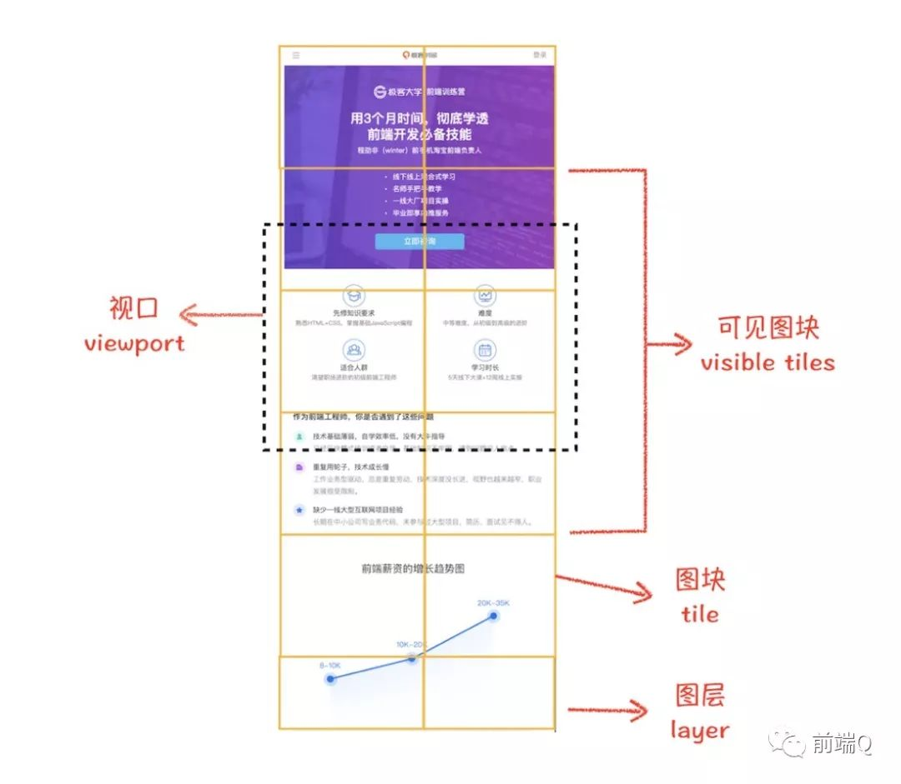

# 浏览器输入URL后发生了什么

## DNS 域名解析

在网络世界，你肯定记得住网站的名称，但是很难记住网站的 IP 地址，因而也需要一个地址簿，就是 DNS 服务器。DNS 服务器是高可用、高并发和分布式的，它是树状结构，如图：



- 根 DNS 服务器 ：返回顶级域 DNS 服务器的 IP 地址
- 顶级域 DNS 服务器：返回权威 DNS 服务器的 IP 地址
- 权威 DNS 服务器 ：返回相应主机的 IP 地址

DNS的域名查找，在客户端和浏览器，本地DNS之间的查询方式是递归查询；在本地DNS服务器与根域及其子域之间的查询方式是迭代查询；



在客户端输入 URL 后，会有一个递归查找的过程，**从浏览器缓存中查找->本地的hosts文件查找->找本地DNS解析器缓存查找->本地DNS服务器查找**，这个过程中任何一步找到了都会结束查找流程。

**如果本地DNS服务器无法查询到，则根据本地DNS服务器设置的转发器进行查询。若未用转发模式，则`迭代查找`过程如下图：**




**浏览器通过向 DNS 服务器发送域名，DNS 服务器查询到与域名相对应的 IP 地址，然后返回给浏览器，浏览器再将 IP 地址打在协议上，同时请求参数也会在协议搭载，然后一并发送给对应的服务器。**

当然，值得注意的是，浏览器提供了DNS数据缓存功能。即如果一个域名已经解析过，那会把解析的结果缓存下来，下次处理直接走缓存，不需要经过 DNS解析。


## 发起 TCP 连接

**首先，判断是不是https的，如果是，则HTTPS其实是HTTP + SSL / TLS 两部分组成，也就是在HTTP上又加了一层处理加密信息的模块。服务端和客户端的信息传输都会通过TLS进行加密，所以传输的数据都是加密后的数据。**

HTTP报文是包裹在TCP报文中发送的，服务器端收到TCP报文时会解包提取出HTTP报文。

但是这个过程中存在一定的风险，HTTP报文是明文，如果中间被截取的话会存在一些信息泄露的风险。那么在进入TCP报文之前对HTTP做一次加密就可以解决这个问题了。

HTTPS协议的本质就是HTTP + SSL(or TLS)。在HTTP报文进入TCP报文之前，先使用SSL对HTTP报文进行加密。从网络的层级结构看它位于HTTP协议与TCP协议之间。



TCP连接建立，两次不安全，四次浪费资源，三次刚刚好。

从最开始双方都处于`CLOSED`状态。然后服务端开始监听某个端口，进入了`LISTEN`状态。

- 第一次握手

客户端主动发起连接，发送`SYN`, 发送完毕后，客户端进入`SYN-SENT`状态。

- 第二次握手

服务端接收到，返回`SYN和ACK`(对应客户端发来的SYN)，发送完毕后，服务器端进入`SYN_RCVD`状态。

- 第三次握手

客户端再发送`ACK`给服务端，发送完毕后，客户端进入`ESTABLISHED`状态；服务端收到ACK之后，也进入`ESTABLISHED`状态，TCP 握手结束。


SSL握手过程

1. 第一阶段 建立安全能力 包括协议版本 会话Id 密码构件 压缩方法和初始随机数
2. 第二阶段 服务器发送证书 密钥交换数据和证书请求，最后发送请求-相应阶段的结束信号
3. 第三阶段 如果有证书请求客户端发送此证书 之后客户端发送密钥交换数据 也可以发送证书验证消息
4. 第四阶段 变更密码构件和结束握手协议

**完成了之后，客户端和服务器端就可以开始传送数据。**

## 发送HTTP请求

TCP连接建立后，浏览器就可以利用 HTTP／HTTPS 协议向服务器发送请求了。

浏览器发 HTTP 请求要携带三样东西：请求行（request line）、请求头（header）和请求体（body）。

请求行：

```js
// 请求方法是GET，路径为根路径，HTTP协议版本为1.1
GET / HTTP/1.1
```

请求头：

请求报头允许客户端向服务器传递请求的附加信息和客户端自身的信息。

比如我们之前说的`Cache-Control`、`If-Modified-Since`、`If-None-Match`都由可能被放入请求头中作为缓存的标识信息。

```
Accept: text/html,application/xhtml+xml,application/xml;q=0.9,image/webp,image/apng,*/*;q=0.8,application/signed-exchange;v=b3
Accept-Encoding: gzip, deflate, br
Accept-Language: zh-CN,zh;q=0.9
Cache-Control: no-cache
Connection: keep-alive
Cookie: /* 省略cookie信息 */
Host: www.baidu.com
Pragma: no-cache
Upgrade-Insecure-Requests: 1
User-Agent: Mozilla/5.0 (iPhone; CPU iPhone OS 11_0 like Mac OS X) AppleWebKit/604.1.38 (KHTML, like Gecko) Version/11.0 Mobile/15A372 Safari/604.1
```

**最后是请求体，也就是请求正文，请求体只有在`POST`方法下存在，常见的场景是表单提交**。

服务器接受到请求，就解析请求头，如果头部有缓存相关信息如`if-none-match`与`if-modified-since`，则验证缓存是否有效，若有效则返回状态码为304，若无效则重新返回资源，状态码为200.

这里有发生的一个过程可参考 [《HTTP缓存机制》](./2.md)

## 服务器处理请求并返回响应结果

HTTP 请求到达服务器，服务器进行对应的处理。最后要把数据传给浏览器，也就是返回网络响应。

跟请求部分类似，网络响应具有三个部分：响应行、响应头和响应体。

响应行类似下面这样:

```js
HTTP/1.1 200 OK
```

由HTTP协议版本、状态码和状态描述组成。

响应头：包含了服务器及其返回数据的一些信息, 服务器生成数据的时间、返回的数据类型以及对即将写入的Cookie信息。

```
Cache-Control: no-cache
Connection: keep-alive
Content-Encoding: gzip
Content-Type: text/html;charset=utf-8
Date: Wed, 04 Dec 2019 12:29:13 GMT
Server: apache
Set-Cookie: rsv_i=f9a0SIItKqzv7kqgAAgphbGyRts3RwTg%2FLyU3Y5Eh5LwyfOOrAsvdezbay0QqkDqFZ0DfQXby4wXKT8Au8O7ZT9UuMsBq2k; path=/; domain=.baidu.com
```

响应体：

服务器返回给浏览器的文本信息，通常HTML, CSS, JS, 图片等文件就放在这一部分。

紧接着，会把数据渲染到页面~~

## 浏览器解析渲染页面

按照渲染的时间顺序，流水线可分为如下几个子阶段：构建 DOM 树、样式计算、布局阶段、分层、栅格化和显示。如图：


1. 渲染进程将 HTML 内容转换为能够读懂 DOM 树结构。
2. 渲染引擎将 CSS 样式表转化为浏览器可以理解的styleSheets，计算出 DOM 节点的样式。
3. 创建布局树，并计算元素的布局信息。
4. 对布局树进行分层，并生成分层树。
5. 为每个图层生成绘制列表，并将其提交到合成线程。合成线程将图层分图块，并栅格化将图块转换成位图。
6. 合成线程发送绘制图块命令给浏览器进程。浏览器进程根据指令生成页面，并显示到显示器上。

### 一、构建 DOM 树

### 二、样式计算

关于CSS样式，它的来源一般是三种:

1. **link标签引用**
2. **style标签中的样式**
3. **元素的内嵌style属性**

- 格式化：

首先，浏览器是无法直接识别 CSS 样式文本的，因此渲染引擎需要将 CSS 样式表转化为浏览器可以理解的 styleSheets，计算出 DOM 节点的样式。

- 标准化：

有一些 CSS 样式的数值并不容易被渲染引擎所理解，因此需要在计算样式之前将它们标准化，如`em`->`px`, `red`->`#ff0000`, `bold`->`700`等等。

- 计算规则：
    - 继承：每个子节点都会默认继承父节点的样式属性，如果父节点中没有找到，就会采用浏览器默认样式，也叫UserAgent样式。
    - 层叠：CSS 最大的特点在于它的层叠性，也就是最终的样式取决于各个属性共同作用的效果，甚至有很多诡异的层叠现象，看过《CSS世界》的同学应该对此深有体会，具体的层叠规则属于深入 CSS 语言的范畴，这里就不过多介绍了。


### 三、生成布局

在已经生成了DOM树和DOM样式，接下来要做的就是通过浏览器的布局系统确定元素的位置，也就是要生成一棵布局树(Layout Tree)。

布局树生成的大致工作如下:

1. 遍历生成的 DOM 树节点，并把他们添加到`布局树中`。
2. 计算布局树节点的坐标位置。



注意：生成时会排除 `display: none` 的节点，并且这个过程需要注意的是`回流和重绘`。

**布局完成过程中，如果有js操作或者其他操作，对元素的颜色，背景等作出改变就会引起重绘，如果有对元素的大小、定位等有改变则会引起回流。**

### 四、建图层树

页面中有很多复杂的效果，如一些复杂的 3D 变换、页面滚动，或者使用 z-indexing 做 z 轴排序等，为了更加方便地实现这些效果，渲染引擎还需要为特定的节点生成专用的图层，并生成一棵对应的图层树（LayerTree），如图：



如果你熟悉 PS，相信你会很容易理解图层的概念，正是这些图层叠加在一起构成了最终的页面图像。在浏览器中，你可以打开 Chrome 的"开发者工具"，选择"Layers"标签。渲染引擎给页面分了很多图层，这些图层按照一定顺序叠加在一起，就形成了最终的页面。

并不是布局树的每个节点都包含一个图层，如果一个节点没有对应的层，那么这个节点就从属于父节点的图层。那么需要满足什么条件，渲染引擎才会为特定的节点创建新的层呢？`待定？？`

### 五、栅格化

合成线程会按照视口附近的图块来优先生成位图，实际生成位图的操作是由栅格化来执行的。所谓栅格化，是指将图块转换为位图。如图：



通常一个页面可能很大，但是用户只能看到其中的一部分，我们把用户可以看到的这个部分叫做视口（viewport）。在有些情况下，有的图层可以很大，比如有的页面你使用滚动条要滚动好久才能滚动到底部，但是通过视口，用户只能看到页面的很小一部分，所以在这种情况下，要绘制出所有图层内容的话，就会产生太大的开销，而且也没有必要。


### 六、显示

通常一个页面可能很大，但是用户只能看到其中的一部分，我们把用户可以看到的这个部分叫做视口（viewport）。在有些情况下，有的图层可以很大，比如有的页面你使用滚动条要滚动好久才能滚动到底部，但是通过视口，用户只能看到页面的很小一部分，所以在这种情况下，要绘制出所有图层内容的话，就会产生太大的开销，而且也没有必要。


**渲染过程参考**


- [浏览器渲染流程&Composite（渲染层合并）简单总结](https://segmentfault.com/a/1190000014520786)

## 断开连接

四次挥手后，client和server成功地断开了连接~

刚开始双方处于`ESTABLISHED`状态。

- 第一次挥手

客户端想要关闭连接，向服务器发送`FIN`报文，发送完毕后，客户端进入`FIN_WAIT_1`状态。

- 第二次挥手

服务端收到该`FIN`报文后，就向客户端发送`ACK`应答报文，接着服务端进入`CLOSED_WAIT`状态。

客户端接收到服务端的`ACK`应答报文后，进入`FIN_WAIT_2`状态。

- 第三次挥手

服务端处理完数据后，向客户端发送`FIN`报文，发送完毕后，服务器端进入`LAST_ACK`状态。

- 第四次挥手

客户端接收到来自服务端的`FIN`报文后，回一个`ACK`应答报文，并进入`TIME_WAIT`状态。

服务端接收到这个确认包之后，关闭连接，进入`CLOSED`状态，至此**服务端已经完成连接的关闭**。

客户端等待了`2MSL`之后，自动进入`CLOSED`状态，**至此客户端也完成连接的关闭**。


- [前端经典面试题: 从输入URL到页面加载发生了什么？](https://segmentfault.com/a/1190000006879700)
- [面试官：浏览器输入URL后发生了什么？](https://mp.weixin.qq.com/s/DLq_GIkdnuOayThfi3jI0A)