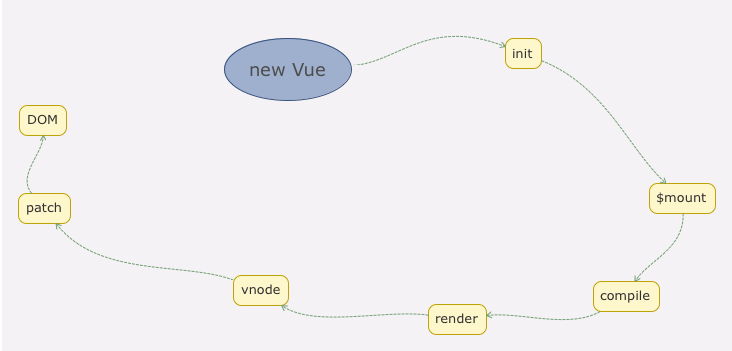

# new Vue 发生了什么
<!-- # 响应式原理

vue数据双向绑定是采用数据劫持结合发布者-订阅者模式的方式，通过`Object.defineProperty()`来劫持各个属性的`setter`，`getter`，在数据变动时发布消息给订阅者，触发相应的监听回调。


参考
- [vue的双向绑定原理及实现](https://www.cnblogs.com/canfoo/p/6891868.html) -->

## 初始化vue

我们在实例化一个 `vue` 实例，也即 `new Vue()` 时，实际上是执行 src/core/instance/index.js 中定义的 `Function` 函数。

```js
function Vue (options) {
  if (process.env.NODE_ENV !== 'production' &&
    !(this instanceof Vue)
  ) {
    warn('Vue is a constructor and should be called with the `new` keyword')
  }
  this._init(options)
}
```

通过查看 `Vue` 的 `function`，我们知道 `Vue` 只能通过 `new` 关键字初始化，然后调用 `this._init` 方法，该方法在 src/core/instance/init.js 中定义。

```js
  Vue.prototype._init = function (options?: Object) {
    const vm: Component = this
      
    // 省略一系列其它初始化的代码
      
    if (vm.$options.el) {
      console.log('vm.$options.el:',vm.$options.el);
      vm.$mount(vm.$options.el)
    }
  }
```

Vue 初始化主要就干了几件事情，合并配置，初始化生命周期，初始化事件中心，初始化渲染，初始化 `data、props、computed、watcher` 等等。

## Vue 实例挂载

Vue 中是通过 `$mount` 实例方法去挂载 `dom` 的，下面我们通过分析 `compiler` 版本的 `mount` 实现，相关源码在目录 src/platforms/web/entry-runtime-with-compiler.js 文件中定义：。

```js
const mount = Vue.prototype.$mount
Vue.prototype.$mount = function (
  el?: string | Element,
  hydrating?: boolean
): Component {
  el = el && query(el)
  
   // 省略一系列初始化以及逻辑判断代码  
 
  return mount.call(this, el, hydrating)
}
```

我们发现最终还是调用用原先原型上的 `$mount` 方法挂载 ，原先原型上的 `$mount` 方法在 src/platforms/web/runtime/index.js 中定义 。

```js
Vue.prototype.$mount = function (
  el?: string | Element,
  hydrating?: boolean
): Component {
  el = el && inBrowser ? query(el) : undefined
  return mountComponent(this, el, hydrating)
}
```

我们发现`$mount` 方法实际上会去调用 `mountComponent` 方法，这个方法定义在 src/core/instance/lifecycle.js 文件中

```js
export function mountComponent (
  vm: Component,
  el: ?Element,
  hydrating?: boolean
): Component {
  vm.$el = el
  // 省略一系列其它代码
  let updateComponent
  /* istanbul ignore if */
  if (process.env.NODE_ENV !== 'production' && config.performance && mark) {
    updateComponent = () => {
      // 生成虚拟 vnode   
      const vnode = vm._render()
      // 更新 DOM
      vm._update(vnode, hydrating)
     
    }
  } else {
    updateComponent = () => {
      vm._update(vm._render(), hydrating)
    }
  }

  // 实例化一个渲染Watcher，在它的回调函数中会调用 updateComponent 方法  
  new Watcher(vm, updateComponent, noop, {
    before () {
      if (vm._isMounted && !vm._isDestroyed) {
        callHook(vm, 'beforeUpdate')
      }
    }
  }, true /* isRenderWatcher */)
  hydrating = false

  return vm
}
```

从上面的代码可以看到，`mountComponent` 核心就是先实例化一个渲染`Watcher`，在它的回调函数中会调用 `updateComponent` 方法，在此方法中调用 `vm._render` 方法先生成虚拟 `Node`，最终调用 `vm._update` 更新 DOM。

## 创建虚拟 Node

Vue 的 `_render` 方法是实例的一个私有方法，它用来把实例渲染成一个虚拟`Node`。它的定义在 src/core/instance/render.js 文件中：

```js
 Vue.prototype._render = function (): VNode {
    const vm: Component = this
    const { render, _parentVnode } = vm.$options
    let vnode
    try {
      // 省略一系列代码  
      currentRenderingInstance = vm
      // 调用 createElement 方法来返回 vnode
      vnode = render.call(vm._renderProxy, vm.$createElement)
    } catch (e) {
      handleError(e, vm, `render`){}
    }
    // set parent
    vnode.parent = _parentVnode
    console.log("vnode...:",vnode);
    return vnode
  }
```

`vm._render` 最终是通过执行 `createElement` 方法并返回的是 `vnode`，它是一个虚拟 Node

Vue.js 利用 `_createElement` 方法创建 `VNode`，它定义在 src/core/vdom/create-elemenet.js 中：

```js
export function _createElement (
  context: Component,
  tag?: string | Class<Component> | Function | Object,
  data?: VNodeData,
  children?: any,
  normalizationType?: number
): VNode | Array<VNode> {
    
  // 省略一系列非主线代码
  
  if (normalizationType === ALWAYS_NORMALIZE) {
    // 场景是 render 函数不是编译生成的
    children = normalizeChildren(children)
  } else if (normalizationType === SIMPLE_NORMALIZE) {
    // 场景是 render 函数是编译生成的
    children = simpleNormalizeChildren(children)
  }
  let vnode, ns
  if (typeof tag === 'string') {
    let Ctor
    ns = (context.$vnode && context.$vnode.ns) || config.getTagNamespace(tag)
    if (config.isReservedTag(tag)) {
      // 创建虚拟 vnode
      vnode = new VNode(
        config.parsePlatformTagName(tag), data, children,
        undefined, undefined, context
      )
    } else if ((!data || !data.pre) && isDef(Ctor = resolveAsset(context.$options, 'components', tag))) {
      // component
      vnode = createComponent(Ctor, data, context, children, tag)
    } else {
      vnode = new VNode(
        tag, data, children,
        undefined, undefined, context
      )
    }
  } else {
    vnode = createComponent(tag, data, context, children)
  }
  if (Array.isArray(vnode)) {
    return vnode
  } else if (isDef(vnode)) {
    if (isDef(ns)) applyNS(vnode, ns)
    if (isDef(data)) registerDeepBindings(data)
    return vnode
  } else {
    return createEmptyVNode()
  }
}
```

`_createElement 方法有` 5 个参数，`context` 表示 `VNode` 的上下文环境，它是 `Component` 类型；`tag`表示标签，它可以是一个字符串，也可以是一个 `Component`；`data` 表示 `VNode` 的数据，它是一个 `VNodeData` 类型，可以在 flow/vnode.js 中找到它的定义；`children` 表示当前 `VNode` 的子节点，它是任意类型的，需要被规范为标准的 `VNode` 数组；


## 更新视图

完成视图的更新工作事实上就是调用了`vm._update`方法，这个方法接收的第一个参数是刚生成的`Vnode`，调用的`vm._update`方法定义在 src/core/instance/lifecycle.js中。

```js
  Vue.prototype._update = function (vnode: VNode, hydrating?: boolean) {
    const vm: Component = this
    const prevEl = vm.$el
    const prevVnode = vm._vnode
    const restoreActiveInstance = setActiveInstance(vm)
    vm._vnode = vnode
    if (!prevVnode) {
      // 第一个参数为真实的node节点，则为初始化
      vm.$el = vm.__patch__(vm.$el, vnode, hydrating, false /* removeOnly */)
    } else {
      // 如果需要diff的prevVnode存在，那么对prevVnode和vnode进行diff
      vm.$el = vm.__patch__(prevVnode, vnode)
    }
    restoreActiveInstance()
    // update __vue__ reference
    if (prevEl) {
      prevEl.__vue__ = null
    }
    if (vm.$el) {
      vm.$el.__vue__ = vm
    }
    // if parent is an HOC, update its $el as well
    if (vm.$vnode && vm.$parent && vm.$vnode === vm.$parent._vnode) {
      vm.$parent.$el = vm.$el
    }
  }
```

往后参考`Diff算法`篇章，主要讲解 

## 总结

那么至此我们从主线上把模板和数据如何渲染成最终的 DOM 的过程分析完毕了，我们可以通过下图更直观地看到从初始化 Vue 到最终渲染的整个过程。


