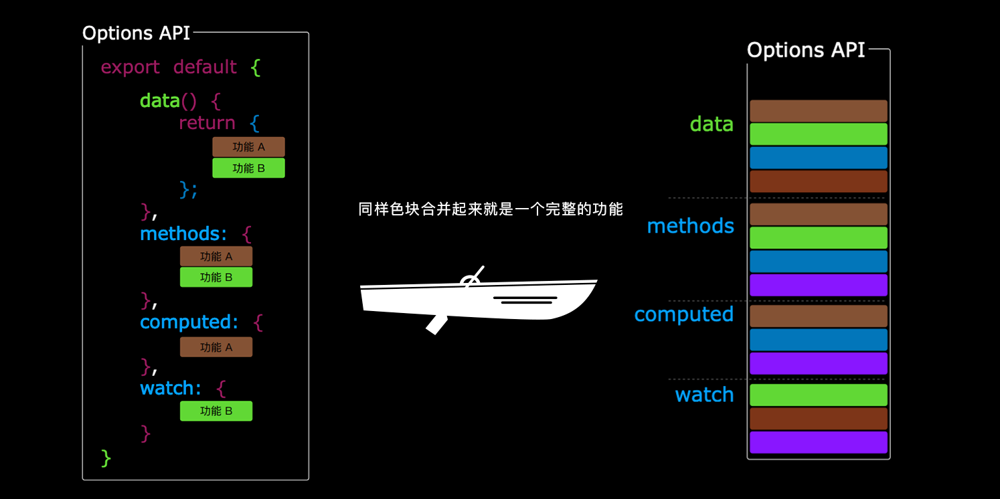
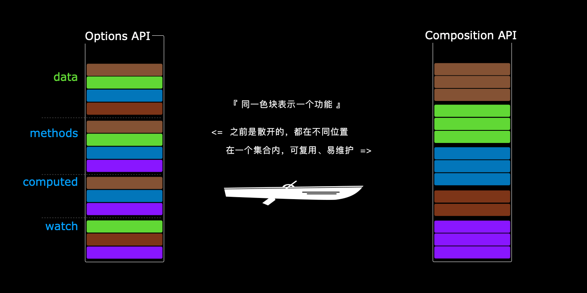
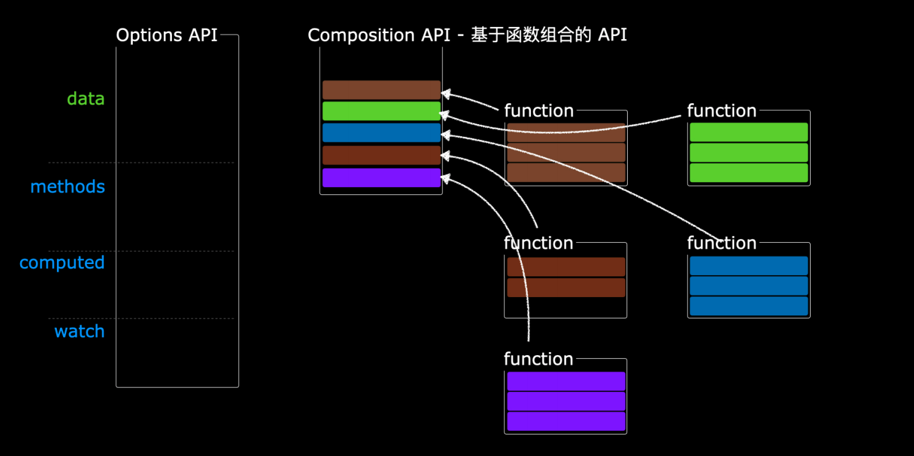

# Vue3.0 遗留万年代码也能重构的Composition API

[掘金查看此文](https://juejin.im/post/6874748339246776327)

Hello，大家好，我是李白~~

昨晚写这篇文章的时候，隔壁在聚餐，几位女生欢聚一堂，整个楼层充满了欢声笑语的味道，就好像早上刷牙刷一半就跑去吃了个鸡蛋。

隐隐约约传来了菜刀与菜板的碰撞声，这刀切的技术似乎略输我一筹。

可就算再怎么样，她们也是一群人吃饭啊。而我只能吃两桶泡面，且还能吃出优越感来~~

可叹可叹，心里还是挺羡慕的，羡慕有一起说说笑笑、一起吃饭的人。

也有点心酸，心酸自己，啥也不是，啥也没有，代码写得再6又有何用、有何用、有何用！！！

但我相信，厨艺肯定没有我好！！！！！！！写代码也没我厉害！！！！身高也是我最高！！！（对着电脑，含泪写的文章 (*T_T*) ）

还请阁下高抬贵手，点个赞~~ 还请大佬口下留情，勿喷我~~

## 使用 Composition API

> Composition API 构建于响应式 API 之上，实现了类似于 `React hook` 的逻辑组成与复用，相较于 2.x 基于对象的 API 方式来说，拥有更加灵活的代码组织模式，以及更为可靠的类型推断能力。可解决 `Vue` 在大规模应用场景中的痛点。

例如：以往写代码的时候，每一个功能会有n个变量和n个方法，分散在各个地方，维护起来苦不堪言，而它的出现就是为了解决这个问题。


开始王炸，简洁明了的对比图献上~~（素材来源[@蜗牛老湿_大圣](https://juejin.im/user/1556564194370270)，加上我**李白精通PS**二次优化的图）







看不懂？？没关系

我们再来看一下代码，以示区别，先实现一个经典的“计时器功能”：

```html
<template>
	<div>{{count}}: {{double}}</div>
	<button @click="increment">+1</button>
</template>
```

```js
// Vue2 写法
export default {
    data(){
        return {
            count: 0
        }
    },
    methods: {
        increment() {
            this.count++;
        }
    },
    computed: {
        double() {
            return this.count * 2;
        }
    }
}
```

上面这种写法，想必大家再熟悉不过了，在组件中实现一个功能，最少得包含这么多的代码块。

这种碎片化使得难以理解和维护复杂的组件。如果需要查找某个功能的逻辑，就得在这个组件里面不断滚动查看代码，看完这个逻辑，忘记前面那个逻辑，来来回回就差砸电脑了。

```js
// Vue3 Composition API
import { ref, computed } from 'vue'
export default {
    setup() {
        let count = ref(0)
        let double = computed(() => count.value * 2)
        function increment() {
            count.value++
        }
        return {
            count,
            double,
            increment
        }
    }
}
```

这样是不是简单多了，没有像`vue2`那么多函数块的规矩，直接就是一把梭哈。不过还有更简洁的，有请往下看~~

**代码+图片**，这要是再看不懂，就别怪我口下不留人了。（我转行了，你们自个玩去吧~）


## 代码封装、复用

`Composition API` 最核心的，就是可以把代码提取出来，把整个功能封装成一个单独的函数（模块），随处可用，也不用担心**变量和方法的命名冲突**。

只需在组件中导入模块，并调用它即可（模块返回的是函数），函数将返回我们定义的变量，随后我们可以从 `setup` 函数中使用它们。

```js
// useCount.js
import { ref, computed } from 'vue'
function useCount() {
    let count = ref(0)
    let double = computed(() => count.value * 2)
    function increment() {
        count.value++
    }
    return {
        count,
        double,
        increment
    }
}
export default useCount

// app.vue
import useCount from './useCount.js'
export default {
	setup() {
		let { count, double, increment } = useCount()
		return { 
			count,
			double,
			increment
		}
	}
}
```

## 两者并存

`option`和`Composition API`是可以共用的，互不影响。

vue2中`data`、`computed`等选项仍然支持，但使用`setup`时不建议再使用vue2中的`data`等选项。

```js
import { ref, computed } from 'vue'
export default {
    setup() {
        let count = ref(0)
        let double = computed(() => count.value * 2)
        function increment() {
            count.value++
        }
        return {
            count,
            double,
            increment
        }
    },
    data() {
        return {
            a: 2
        }
    },
    mounted() {
        // 可使用setup的返回值
        console.log(this)
    }
}
```

## setup 函数

- 执行机制

`setup`是在创建组件实例并完成`props`初始化之后执行的，也是在`beforeCreate`钩子之前执行，无法访问option(`data`、`comupted`、`methods`等)选项，而option可使用`setup`中返回的变量。

- 没有 `this`：在解析其他组件选项之前就已经调用了 `setup()`

- 接受两个参数：
    - props：组件传参
    - context：执行上下文，包含三个属性方法：`attrs`、`slots`、`emit`

```js
export default {
    props: {
        user: {
            type: String,
            defalut: 'Libai'
        }
    },
    setup(props, context) {
        console.log(props.user)
        console.log(context)
    }
}
```

- 生命周期

其内部使用**生命周期钩子**需要在前面加上**on**

因为 `setup` 是围绕 `beforeCreate` 和 `created` 生命周期钩子运行的，所以不需要显式地定义它们。换句话说，在这些钩子中编写的任何代码都应该直接在 `setup` 函数中编写。

```js
import { onMounted } from 'vue'
export default {
    setup() {
        // mounted
        onMounted(() => {
            console.log('Component is mounted!')
        })
    }
}
```

钩子函数	  | setup使用
------------- | -------------
beforeCreate  |	不支持
created	| 不支持
beforeMount	| onBeforeMount
mounted |	onMounted
beforeUpdate  |	onBeforeUpdate
updated |	onUpdated
beforeUnmount  |	onBeforeUnmount
unmounted  |	onUnmounted
errorCaptured	| onErrorCaptured
renderTracked |	onRenderTracked
renderTriggered |	onRenderTriggered


- 渲染函数

`setup` 还可以返回一个渲染函数，该函数可以直接使用在同一作用域中声明的响应式状态：

```js
// MyBook.vue
import { h, ref, reactive } from 'vue'
export default {
  setup() {
    const readersNumber = ref(0)
    const book = reactive({ title: 'Vue 3 Guide' })
    // Please note that we need to explicitly expose ref value here
    return () => h('div', [readersNumber.value, book.title])
  }
}
```

## provide & inject

类似于vue2中`provide`与`inject`, vue3提供了对应的`provide`与`inject` API，实现组件传参。


provide 函数允许你通过两个参数定义 property：

- property 的 name (`<String>` 类型)
- property 的 value

```html
<!-- src/components/MyMap.vue -->
<template>
  <MyMarker />
</template>

<script>
import { provide } from 'vue'
import MyMarker from './MyMarker.vue'
export default {
  components: {
    MyMarker
  },
  setup() {
    provide('location', 'North Pole')
    provide('geolocation', {
      longitude: 90,
      latitude: 135
    })
  }
}
</script>
```

`inject` 函数有两个参数：

- 要注入的 `property` 的名词
- 一个默认的值 (可选)

```html
<!-- src/components/MyMarker.vue -->
<script>
import { inject } from 'vue'
export default {
  setup() {
    const userLocation = inject('location', 'The Universe')
    const userGeolocation = inject('geolocation')
    return {
      userLocation,
      userGeolocation
    }
  }
}
</script>
```

## watch & computed

- watch：侦听器，接受三个参数
    - 一个响应式引用或我们想要侦听的 getter 函数
    - 一个回调
    - 可选的配置选项

```js
import { ref, watch } from 'vue'
export default {
    setup() {
        const counter = ref(0)
        watch(counter, (newValue, oldValue) => {
            console.log('The new counter value is: ' + counter.value)
        })
    },
    // setup中的相当于以下
    data() {
        return {
            counter: 0
        }
    },
    watch: {
        counter(newValue, oldValue) {
            console.log('The new counter value is: ' + this.counter)
        }
    }
}
```

`watch`的第三个参数，可配置选项：

```js
{
    deep: true,     // 深度监听
    lazy: true,     // vue中的immediate，默认挂载后执行
    flush: '',      // 三个值：'post'(默认), 'pre', 'sync'
                    // 'pre': 表示在状态更新时同步调用
                    // 'sync':表示在组件更新之前调用
    onTrack(){},    // 在reactive属性或ref被追踪为依赖时调用。
    onTrigger(){}   // 在watcher的回调因依赖改变而触发时调用。
}
```

- computed

与vue2中`computed`功能一致，它接收一个函数并返回一个`value`为`getter`返回值的不可改变的响应式`ref`对象。

```js
const count = ref(1)
const plusOne = computed(() => count.value + 1)
console.log(plusOne.value) // 2
plusOne.value++ // 错误，computed不可改变

// 同样支持set和get属性
onst count = ref(1)
const plusOne = computed({
    get: () => count.value + 1,
    set: val => { count.value = val - 1 }
})
plusOne.value = 1
console.log(count.value) // 0
```

## 总结

任何事物都有两面性，再完美的背后也会有黑暗存在。暂时还不知道`Composition API`有何弊端，先告辞了~~

小白写文，如写得不好，还请给个建议~~ 如果对你有帮助的话，还请点个赞~~

如果有下一篇文章的话，应该就是响应式了。

更多信息分享：

- [全面分析toString与valueOf，并随手解决掉几道大厂必备面试题](https://juejin.im/post/6873215243804213262)
- [不会写作的程序猿不是一个好程序猿](https://raindays.cn/)
- [一个基于vuepress的前端学习笔记，记录，只是为了更好的摸鱼](https://github.com/wsydxiangwang/Note)
- [Vue、Nuxt服务端渲染、NodeJS全栈项目~面向小白的完美系统~](https://juejin.im/post/6845166890436788232)
