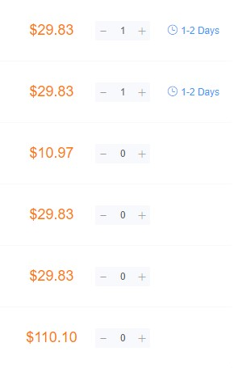

# 防抖多列表的骚操作

看好了，这是一个防抖，对吧~~

```js
function debounce(fn, interval) {
    let timer = null;
    return function (...args) {
        if(timer) clearTimeout(timer);
        timer = setTimeout(() => {
            fn.apply(this, args);
        }, interval);
    }
}
```

现在有一个需求：看下面的图片，每次增减数量的时候都需要发起请求，每个列表的需要请求的数据不一致，使用以上的防抖会导致：

如果我在防抖时间之内连续点击多个列表，那么结果可想而知，只会请求最后一个点击的。

因为函数指向的作用域处于同一个



那么，该怎么办呢~~

目前重构的新项目，使用原生JS开发的，没有用框架之类的，更没有组件可用，所以只能来改造防抖这个全局方法

这时候，万能的对象就来了~

把不同方法名 or 指定值，作为属性存起来，作为公共的方法，同一组里面的列表来指定不同属性值，这样就不会互相影响，各玩各的

```html
<ul style="margin: 70px;">
    <li data-id="1">1111111</li>
    <li data-id="2">2222222</li>
    <li data-id="3">3333333</li>
    <li data-id="4">4444444</li>
    <li data-id="5">5555555</li>
</ul>
```

```js
function sayHi(id){ console.log('hi', id) }

const oLi = document.querySelectorAll('li')

for(let i = 0; i < oLi.length; i++){
    oLi[i].addEventListener('click', function(){
        const id = this.getAttribute('data-id');
        debounce(sayHi, 1000, id)(id)
    })
}

const timeout = {}
function debounce(fn, interval, type) {
    // 优先使用指定值作为属性，否则就用方法名
    const name = type ? type : fn.name;
    return function () {
        // 清除指定属性的定时器，再重新赋值
        clearTimeout(timeout[name])
        timeout[name] = setTimeout(() => {
            fn.apply(this, arguments);
        }, interval)
    }
}
```