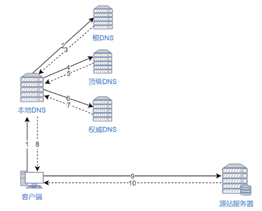
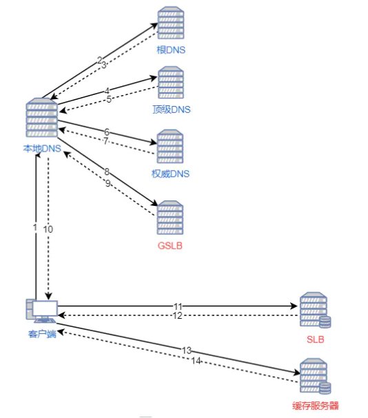

# 前端性能优化总结

## 减少 HTTP 请求

一个完整的 HTTP 请求需要经历 DNS 查找，TCP 握手，浏览器发出 HTTP 请求，服务器接收请求，服务器处理请求并发回响应，浏览器接收响应等过程。

接下来看一个具体的例子帮助理解 HTTP ：


这是一个 HTTP 请求，请求的文件大小为 28.4KB。

名词解释：

- Queueing: 在请求队列中的时间。
- Stalled: 从TCP 连接建立完成，到真正可以传输数据之间的时间差，此时间包括代理协商时间。
- Proxy negotiation: 与代理服务器连接进行协商所花费的时间。
- DNS Lookup: 执行DNS查找所花费的时间，页面上的每个不同的域都需要进行DNS查找。
- Initial Connection / Connecting: 建立连接所花费的时间，包括TCP握手/重试和协商SSL。
- SSL: 完成SSL握手所花费的时间。
- Request sent: 发出网络请求所花费的时间，通常为一毫秒的时间。
- Waiting(TFFB): TFFB 是发出页面请求到接收到应答数据第一个字节的时间总和，它包含了 DNS 解析时间、 TCP 连接时间、发送 HTTP 请求时间和获得响应消息第一个字节的时间。
- Content Download: 接收响应数据所花费的时间。

从这个例子可以看出，真正下载数据的时间占比为 `13.05 / 204.16 = 6.39%`，文件越小，这个比例越小，文件越大，比例就越高。这就是为什么要建议将多个小文件合并为一个大文件，从而减少 HTTP 请求次数的原因。

- [understanding-resource-timing](https://developers.google.com/web/tools/chrome-devtools/network/understanding-resource-timing)

## 使用 HTTP2

HTTP2 相比 HTTP1.1 有如下几个优点：


## 使用服务端渲染

客户端渲染(SPA): 获取 HTML 文件，根据需要下载 JavaScript 文件，运行文件，生成 DOM，再渲染。

服务端渲染(SSR)：服务端返回 HTML 文件，客户端只需解析 HTML。

- 优点：首屏渲染快，SEO 好。
- 缺点：配置麻烦，增加了服务器的计算压力。

## 静态资源使用 CDN

内容分发网络（CDN）是一组分布在多个不同地理位置的 Web 服务器。我们都知道，当服务器离用户越远时，延迟越高。CDN 就是为了解决这一问题，在多个位置部署服务器，让用户离服务器更近，从而缩短请求时间。

**CDN 原理**

当用户访问一个网站时，如果没有 CDN，过程是这样的：

1. 浏览器要将域名解析为 IP 地址，所以需要向本地 DNS 发出请求。
2. 本地 DNS 依次向根服务器、顶级域名服务器、权限服务器发出请求，得到网站服务器的 IP 地址。
3. 本地 DNS 将 IP 地址发回给浏览器，浏览器向网站服务器 IP 地址发出请求并得到资源。



如果用户访问的网站部署了 CDN，过程是这样的：

1. 浏览器要将域名解析为 IP 地址，所以需要向本地 DNS 发出请求。
2. 本地 DNS 依次向根服务器、顶级域名服务器、权限服务器发出请求，得到全局负载均衡系统（GSLB）的 IP 地址。
3. 本地 DNS 再向 GSLB 发出请求，GSLB 的主要功能是根据本地 DNS 的 IP 地址判断用户的位置，筛选出距离用户较近的本地负载均衡系统（SLB），并将4. 该 SLB 的 IP 地址作为结果返回给本地 DNS。
5. 本地 DNS 将 SLB 的 IP 地址发回给浏览器，浏览器向 SLB 发出请求。
6. SLB 根据浏览器请求的资源和地址，选出最优的缓存服务器发回给浏览器。
7. 浏览器再根据 SLB 发回的地址重定向到缓存服务器。
8. 如果缓存服务器有浏览器需要的资源，就将资源发回给浏览器。如果没有，就向源服务器请求资源，再发给浏览器并缓存在本地。



## 将 CSS 放在文件头部，JavaScript 文件放在底部

所有放在 head 标签里的 CSS 和 JS 文件都会堵塞渲染。如果这些 CSS 和 JS 需要加载和解析很久的话，那么页面就空白了。所以 JS 文件要放在底部，等 HTML 解析完了再加载 JS 文件。

那为什么 CSS 文件还要放在头部呢？

因为先加载 HTML 再加载 CSS，会让用户第一时间看到的页面是没有样式的、“丑陋”的，为了避免这种情况发生，就要将 CSS 文件放在头部了。

另外，JS 文件也不是不可以放在头部，只要给 `script` 标签加上 `defer` 属性就可以了，异步下载，延迟执行。

参考：[script的加载和执行](./6)

## 善用缓存，不重复加载相同的资源

为了避免用户每次访问网站都得请求文件，我们可以通过添加 Expires 或 max-age 来控制这一行为。Expires 设置了一个时间，只要在这个时间之前，浏览器都不会请求文件，而是直接使用缓存。而 max-age 是一个相对时间，建议使用 max-age 代替 Expires 。

- [webpack + express 实现文件精确缓存](https://github.com/woai3c/node-blog/blob/master/doc/node-blog7.md)
- [webpack 缓存](https://www.webpackjs.com/guides/caching/)
- [大公司里怎样开发和部署前端代码？](https://www.zhihu.com/question/20790576/answer/32602154)

## 压缩文件

压缩文件可以减少文件下载时间，让用户体验性更好。
得益于 webpack 和 node 的发展，现在压缩文件已经非常方便了。
在 webpack 可以使用如下插件进行压缩：

- JavaScript：UglifyPlugin
- CSS ：MiniCssExtractPlugin
- HTML：HtmlWebpackPlugin

> 其实，我们还可以做得更好。那就是使用 gzip 压缩。可以通过向 HTTP 请求头中的 Accept-Encoding 头添加 gzip 标识来开启这一功能。当然，服务器也得支持这一功能。
> gzip 是目前最流行和最有效的压缩方法。举个例子，我用 Vue 开发的项目构建后生成的 app.js 文件大小为 1.4MB，使用 gzip 压缩后只有 573KB，体积减少了将近 60%。

附上 webpack 和 node 配置 gzip 的使用方法。

```js
npm install compression-webpack-plugin --save-dev
npm install compression
```

webpack 配置

```js
const CompressionPlugin = require('compression-webpack-plugin');

module.exports = {
  plugins: [new CompressionPlugin()],
}
```

node 配置

```js
const compression = require('compression')
// 在其他中间件前使用
app.use(compression())
```

### 压缩图片

压缩方法有两种，一是通过 `webpack` 插件 `image-webpack-loader`，二是通过在线网站进行压缩。

```js
npm i -D image-webpack-loader
```

Webpack 配置如下

```js
{
  test: /\.(png|jpe?g|gif|svg)(\?.*)?$/,
  use:[
    {
    loader: 'url-loader',
    options: {
      limit: 10000, /* 图片大小小于1000字节限制时会自动转成 base64 码引用*/
      name: utils.assetsPath('img/[name].[hash:7].[ext]')
      }
    },
    /*对图片进行压缩*/
    {
      loader: 'image-webpack-loader',
      options: {
        bypassOnDebug: true,
      }
    }
  ]
}
```

### 调整图片大小

例如，你有一个 1920 * 1080 大小的图片，用缩略图的方式展示给用户，并且当用户鼠标悬停在上面时才展示全图。如果用户从未真正将鼠标悬停在缩略图上，则浪费了下载图片的时间。

所以，我们可以用两张图片来实行优化。一开始，只加载缩略图，当用户悬停在图片上时，才加载大图。还有一种办法，即对大图进行延迟加载，在所有元素都加载完成后手动更改大图的 src 进行下载。

### 尽可能利用 CSS3 效果代替图片

有很多图片使用 CSS 效果（渐变、阴影等）就能画出来，这种情况选择 CSS3 效果更好。因为代码大小通常是图片大小的几分之一甚至几十分之一。

### 使用 webp 格式的图片

WebP 的优势体现在它具有更优的图像数据压缩算法，能带来更小的图片体积，而且拥有肉眼识别无差异的图像质量；同时具备了无损和有损的压缩模式、Alpha 透明以及动画的特性，在 JPEG 和 PNG 上的转化效果都相当优秀、稳定和统一。

参考：[WebP 相对于 PNG、JPG 有什么优势？](https://www.zhihu.com/question/27201061)

## 按需加载

## CDN

[暂时参考](https://juejin.im/post/6844903844455907336)

## 使用事件委托

事件委托利用了事件冒泡，只指定一个事件处理程序，就可以管理某一类型的所有事件。所有用到按钮的事件（多数鼠标事件和键盘事件）都适合采用事件委托技术， 使用事件委托可以节省内存。

```js
<ul>
    <li>苹果</li>
    <li>香蕉</li>
    <li>凤梨</li>
</ul>

// good
document.querySelector('ul').onclick = (event) => {
    const target = event.target
    if (target.nodeName === 'LI') {
        console.log(target.innerHTML)
    }
}

// bad
document.querySelectorAll('li').forEach((e) => {
    e.onclick = function() {
        console.log(this.innerHTML)
    }
}) 
```

## 图片

### 懒加载

在页面中，先不给图片设置路径，只有当图片出现在浏览器的可视区域时，才去加载真正的图片，这就是懒加载。对于图片很多的网站来说，一次性加载全部图片，会对用户体验造成很大的影响，所以需要使用图片延迟加载。

首先可以将图片这样设置，在页面不可见时图片不会加载：

```html

```

等页面可见时，使用 JS 加载图片：

```js
const img = document.querySelector('img')
img.src = img.dataset.src
```

参考：[图片懒加载实现](./2)

### 响应式图片

响应式图片的优点是浏览器能够根据屏幕大小自动加载合适的图片。

通过 `picture` 实现：

```html
<picture>
	<source srcset="banner_w1000.jpg" media="(min-width: 801px)">
	<source srcset="banner_w800.jpg" media="(max-width: 800px)">
	
</picture>
```

通过 `@media` 实现：

```css
@media (min-width: 769px) {
	.bg {
		background-image: url(bg1080.jpg);
	}
}
@media (max-width: 768px) {
	.bg {
		background-image: url(bg768.jpg);
	}
}
```
